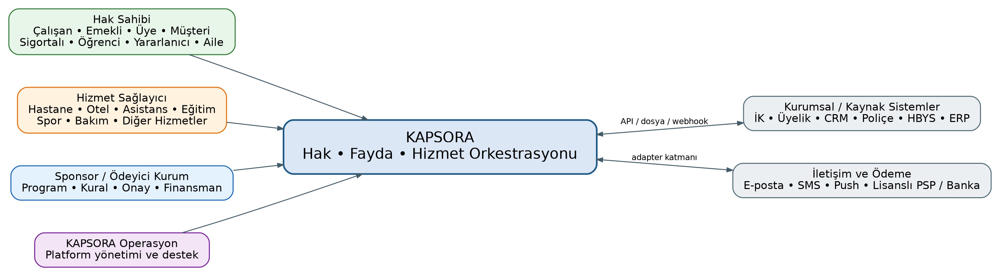
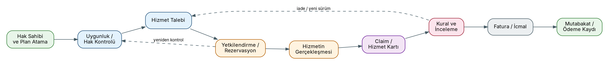
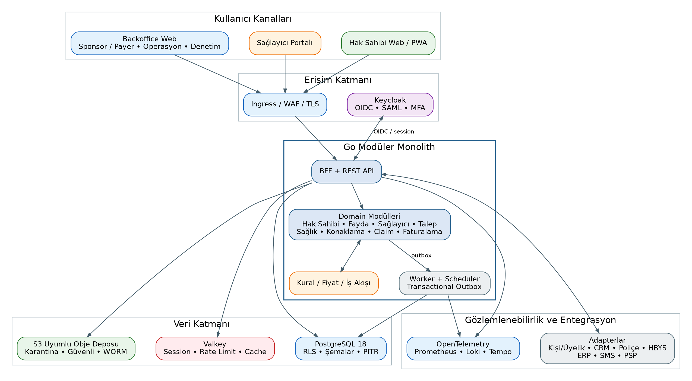
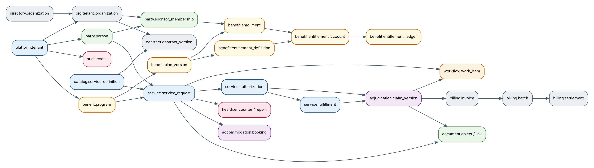
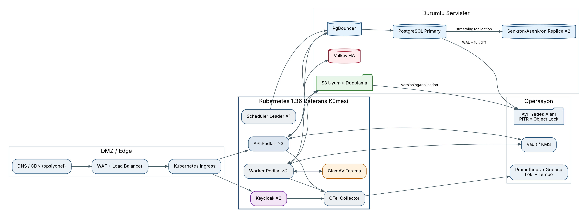

```{=openxml}
<w:p><w:pPr><w:jc w:val="center"/><w:spacing w:before="2400"/></w:pPr><w:r><w:rPr><w:b/><w:sz w:val="52"/><w:color w:val="17365D"/></w:rPr><w:t>KAPSORA</w:t></w:r></w:p>
<w:p><w:pPr><w:jc w:val="center"/><w:spacing w:before="200"/></w:pPr><w:r><w:rPr><w:b/><w:sz w:val="30"/><w:color w:val="2E6B4F"/></w:rPr><w:t>Kurumsal Hak, Fayda ve Hizmet Orkestrasyon Platformu</w:t></w:r></w:p>
<w:p><w:pPr><w:jc w:val="center"/><w:spacing w:before="900"/></w:pPr><w:r><w:rPr><w:sz w:val="24"/></w:rPr><w:t>Teknik Proje Şartnamesi ve Geliştirme Referansı</w:t></w:r></w:p>
<w:p><w:pPr><w:jc w:val="center"/><w:spacing w:before="1200"/></w:pPr><w:r><w:rPr><w:sz w:val="22"/></w:rPr><w:t>Sürüm 1.2 - Genel Kurum ve Hak Sahibi Modeli Baseline'ı</w:t></w:r></w:p>
<w:p><w:pPr><w:jc w:val="center"/><w:spacing w:before="200"/></w:pPr><w:r><w:rPr><w:sz w:val="20"/></w:rPr><w:t>08 Ağustos 2026</w:t></w:r></w:p>
<w:p><w:pPr><w:jc w:val="center"/><w:spacing w:before="1800"/></w:pPr><w:r><w:rPr><w:i/><w:sz w:val="18"/><w:color w:val="666666"/></w:rPr><w:t>Durum: Yazılım ekibinin geliştirmeye başlaması için onaylı teknik başlangıç dokümanı</w:t></w:r></w:p>
<w:p><w:r><w:br w:type="page"/></w:r></w:p>
```

# Doküman Kontrolü

| Alan | Değer |
|---|---|
| Doküman adı | KAPSORA Teknik Proje Şartnamesi ve Geliştirme Referansı |
| Doküman sürümü | 1.2 |
| Ürün çalışma adı | KAPSORA |
| Doküman tarihi | 08.08.2026 |
| Teknik temel | Go, PostgreSQL, React/TypeScript, modüler monolith |
| Hedef müşteriler | Hak, fayda veya hizmet programı yöneten özel/kamu tüm kurum ve kuruluşları; öncelikli ticari segmentler banka ve sigorta şirketleridir |
| İlk dikeyler | Sağlık; tatil ve konaklama |
| Statü | Genel kurum ve hak sahibi modeli için geliştirme baseline'ı |
| Değişiklik yönetimi | Bu dokümandaki kritik kararlar yalnız ADR veya onaylı değişiklik talebi ile değiştirilir |

## Sürüm Geçmişi

| Sürüm | Tarih | Açıklama |
|---|---|---|
| 1.2 | 08.08.2026 | Müşteri kapsamının sektör bağımsız hale getirilmesi; sponsor kurum ve hak sahibi modelinin holding, şirket, kamu kurumu, belediye, dernek, vakıf, sandık, sendika, oda, üniversite, kooperatif, federasyon ve benzeri yapılara genişletilmesi. Banka ve sigorta şirketleri ürün sınırı değil, öncelikli satış segmenti olarak tanımlandı. |
| 1.1 | 08.08.2026 | Geliştirme-ready teknik şartnamenin bağımsız ürün baseline'ı olarak sabitlenmesi; ürün, mimari, veri modeli, API, güvenlik ve müşteri/harici sistem izolasyonu kararlarının normatif hale getirilmesi. |

## Normatif Dil

Bu dokümanda:

- **ZORUNLU / MUST**: Uygulama ve kabul için vazgeçilmez gereksinimdir.
- **ÖNERİLEN / SHOULD**: Güçlü gerekçe olmadıkça uygulanmalıdır; sapma ADR ile kaydedilir.
- **OPSİYONEL / MAY**: Ürün veya müşteri ihtiyacına göre uygulanabilir.
- **MVP**: İlk pilot müşteride üretim kullanımına alınacak minimum fakat güvenli ve denetlenebilir ürün kapsamıdır.
- **Tenant**: Platformda bağımsız veri, yetki ve konfigürasyon alanına sahip müşteri kurum/kuruluş veya işletim bağlamıdır. Sektör türü tenant modelini değiştirmez.

Bu doküman bir fikir özeti değildir. Ürün kapsamı, modül sınırları, teknik kararlar, veri bütünlüğü, güvenlik ve kabul kriterleri bakımından geliştirme ekibinin başlangıç referansıdır. Belirsizlikler yalnız **Karar Gerektiren Konular** bölümünde bırakılmıştır; bu konular için de geliştirmeyi bloke etmeyen varsayılan kararlar verilmiştir.

# Yönetici Özeti

KAPSORA; hak, fayda veya hizmet programı yöneten kurum ve kuruluşların çalışanlarına, emeklilerine, üyelerine, müşterilerine, sigortalılarına, öğrencilerine, aile bireylerine, sosyal yardım yararlanıcılarına veya tanımladıkları diğer hak sahibi gruplarına sunduğu sağlık, konaklama, asistans, eğitim, spor, bakım, ulaşım ve benzeri hizmetleri tek platformdan yönetir. Bankalar ve sigorta şirketleri öncelikli ticari segmentlerdir; ancak ürün mimarisi hiçbir sektöre özgü değildir. Sistem yalnız bir indirim kataloğu ya da rezervasyon sitesi değildir. Temel görevi, bir kişinin belirli bir tarihte belirli bir sağlayıcıdan hangi hizmeti, hangi kapsam, kota, limit, fiyat, katkı payı ve onay koşullarıyla alabileceğini belirlemek; hizmetin gerçekleşmesini, faturasını ve mutabakatını uçtan uca izlemektir.

Ürünün ortak çekirdeği şu yaşam döngüsünü yönetir:

> Hak sahipliği ve plan kaydı -> uygunluk kontrolü -> talep -> ön onay veya rezervasyon -> hak rezervasyonu -> hizmetin gerçekleşmesi -> claim/hizmet kaydı -> kural ve fiyat değerlendirmesi -> dış sistemde kesilmiş fatura kaydı -> icmal/batch -> inceleme -> kesinti/iade/ret/onay -> ödeme ve mutabakat kaydı.

İlk ürün sürümünde iki dikey birlikte geliştirilecektir:

1. **Sağlık dikeyi:** Ayakta tedavi, temel yatarak tedavi ön onayı, tedavi raporu, hizmet/claim kaydı, tıbbi ve mali değerlendirme, fatura ve icmal.
2. **Tatil ve konaklama dikeyi:** Tesis ve oda kataloğu, günlük kontenjan, rezervasyon hold'u, kurum/hak sahibi payı, voucher, iptal/no-show, bekleme listesi, fatura ve mutabakat.

Bu iki dikeyin aynı çekirdekte çalışması, sistemin gerçekten sağlık dışına genişleyebilir olduğunu daha ilk sürümde doğrular.

Teknik mimari; **Go ile modüler monolith**, **PostgreSQL 18**, ayrı API/worker/scheduler process'leri, **Keycloak tabanlı OIDC**, React/TypeScript web uygulamaları, S3 uyumlu obje depolama, Valkey cache/session katmanı ve PostgreSQL transactional outbox yaklaşımıdır. İlk sürümde mikroservis, Kafka, Elasticsearch, genel amaçlı BPMN motoru veya yapay zekâ tabanlı otomatik karar sistemi kullanılmayacaktır.

# 1. Ürün Adı ve Kimliği

## 1.1 Çalışma Adı: KAPSORA

**KAPSORA**, ürünün hem kapsam/hak mantığını hem de farklı hizmetleri tek akışta orkestre etmesini ifade eden çalışma adıdır.

**Tam ürün adı:**

> KAPSORA - Kurumsal Hak, Fayda ve Hizmet Orkestrasyon Platformu

**İngilizce tanım:**

> KAPSORA - Enterprise Entitlement, Benefit and Service Orchestration Platform

Ad sağlıkla veya belirli bir sektörle sınırlı değildir; kurumsal fayda, üyelik, sosyal destek, sigortacılık, konaklama, asistans ve ileride eklenecek diğer dikeylere uygundur. Geliştirme repository adı `kapsora` olacaktır. Marka tescili ve alan adı araştırması üretim lansmanından önce yapılacaktır; bu durum teknik geliştirmeyi bloke etmez.

## 1.2 Vizyon Cümlesi

Kurum ve kuruluşların farklı hak sahibi gruplarına sunduğu her türlü hizmet hakkını; sağlayıcı ağı, sözleşme, kural, kota, rezervasyon, katkı payı, fatura, ödeme ve denetim izi ile birlikte tek işletim platformunda yönetmek.

## 1.3 Temel Değer Önerisi

KAPSORA aşağıdaki parçalı yapıyı tek modele dönüştürür:

- İnsan kaynakları, üyelik, CRM, poliçe, öğrenci, sosyal yardım veya diğer kaynak sistemlerdeki hak sahibi bilgisi,
- Sağlayıcılarla yapılan ayrı sözleşmeler,
- Excel veya e-posta ile yürütülen onaylar,
- Sağlık provizyonu,
- Otel/sosyal tesis rezervasyonu,
- Hak sahibi katkı payı,
- Fatura ve icmal kontrolü,
- Kurum içi onay ve ödeme,
- Denetim ve raporlama.

Kurum açısından sonuç; maliyet kontrolü, kuralların merkezi uygulanması, sağlayıcı performansının ölçülmesi ve suistimal riskinin azaltılmasıdır. Hak sahibi açısından sonuç; hangi hakkının bulunduğunu, ne kadar ödeyeceğini ve başvurusunun hangi aşamada olduğunu şeffaf biçimde görebildiği tek kanaldır. Sağlayıcı açısından sonuç; uygunluk, onay, belge, fatura ve mutabakat süreçlerinin standartlaşmasıdır.

## 1.4 Hedef Müşteri ve Hak Sahibi Modeli

KAPSORA'nın ürün sınırı sektör değildir. Platform, bir veya daha fazla hak sahibi grubuna kurallı, limitli, sözleşmeli ya da finansmanlı hizmet sunan herhangi bir kurum veya kuruluşta kullanılabilir.

**Örnek sponsor/müşteri kurum tipleri:**

- Banka ve sigorta şirketleri - öncelikli ticari segmentler,
- Holdingler, grup şirketleri ve bağımsız özel şirketler,
- Kamu kurumları, belediyeler ve kamu iştirakleri,
- Dernekler, vakıflar, sandıklar ve sosyal yardım yapıları,
- Sendikalar, meslek odaları, birlikler ve federasyonlar,
- Üniversiteler, eğitim kurumları ve öğrenci destek yapıları,
- Kooperatifler ve üyelik temelli organizasyonlar,
- Müşteri, bayi, iş ortağı veya topluluk programı yöneten diğer kurumlar.

**Hak sahibi tipi sabit bir enum ile ürün düzeyinde sınırlandırılmayacaktır.** Tenant, kontrollü bir ilişki tipleri kataloğu üzerinden çalışan, emekli, üye, müşteri, sigortalı, öğrenci, bayi, iş ortağı, yararlanıcı, aile bireyi, bağımlı veya başka program katılımcılarını tanımlayabilir. Sistem davranışını belirleyen asıl unsur kişinin unvanı değil; `sponsor + program + enrollment + plan + entitlement` ilişkisidir.

Bankalar ve sigorta şirketleri satış ve pilotlama açısından öncelikli olabilir; bu öncelik veri modeline, ekran isimlerine, API'lere veya çekirdek iş kurallarına sektör bağımlılığı olarak yansıtılmayacaktır.

# 2. Tasarım İlkeleri ve Ürün Bağımsızlığı

## 2.1 Bağımsız Ürün İlkesi

KAPSORA sıfırdan, bağımsız, sektör ve müşteriden bağımsız bir ürün olarak tasarlanacaktır. Çekirdek veri modeli, API'ler, kullanıcı arayüzleri, kod tabanı, dokümantasyon, demo ortamları ve seed/test verileri herhangi bir kurum, kuruluş, sektör, hizmet sağlayıcı, üçüncü taraf ürün veya mevcut sistemin özel isimlerine ya da kurum-içi terminolojisine bağımlı olmayacaktır.

Kod, doküman, ekran, demo, satış materyali ve örnek verilerde aşağıdaki unsurlar yer alamaz; yalnız ilgili müşterinin kendi tenant konfigürasyonu veya gerçek entegrasyon verisi olarak, yetki sınırları içinde bulunabilir:

- Harici kurum, kuruluş, ürün veya sistem adları,
- Gerçek kişi adları veya kişileri tanımlayabilecek özel referanslar,
- Harici sistemlere ait ekran görüntüleri, logolar veya görsel kimlik öğeleri,
- Harici kaynaklara ait telefon, e-posta, adres ve diğer iletişim bilgileri,
- Tek bir müşteriye özgü sabit süreler, limitler, eşikler veya referans formatları,
- Harici sistemlerin kullanıcı adı/şifre kuralları veya kurum-içi birim adları,
- Harici sistemlere özgü işlem kodları, durum adları veya teknik tanımlayıcılar,
- Üretim ortamından alınmış gerçek kişisel, finansal veya sağlık verileri,
- Başka bir ürünün marka kimliğini, ekran düzenini veya kullanıcı deneyimini taklit eden öğeler.

## 2.2 Genel Çekirdek ve Dikey Genişleme

KAPSORA'nın ortak çekirdeği sağlıkla sınırlı değildir. İlk sürümde sağlık ve tatil/konaklama iki referans dikey olarak uygulanacak; temel model aşağıdaki genel yetenekler üzerine kurulacaktır:

- Genel hizmet sağlayıcı ve sağlayıcı ağı modeli,
- Genel program, fayda planı ve hak sahipliği modeli,
- Talep, authorization, rezervasyon, voucher, iş emri, üyelik ve geri ödeme hizmet biçimleri,
- Para yanında gece, seans, saat, kilometre, adet ve puan cinsinden haklar,
- Kapasite ve envanter gerektiren hizmetler için hold ve rezervasyon modeli,
- Çok kurumlu ve tenant-aware mimari,
- Modern web, API ve mobil/PWA entegrasyonuna hazır yüzeyler,
- Kuralları uygulama kodundan ayıran versiyonlu karar tabloları,
- Sağlık verisini diğer fayda verilerinden daha sıkı ayıran yetkilendirme modeli,
- Obje depolama, audit, observability, CI/CD ve felaket kurtarma altyapısı.

## 2.3 Müşteriye Özel Kural İzolasyonu

Müşteriye özgü iş kuralları Go koduna veya ortak veritabanı şemasına hard-code edilmeyecektir. Geriye dönük işlem süresi, batch min/max sayısı, business reference formatı, onay eşiği, katılım payı, hizmet limiti, belge zorunluluğu ve sağlayıcı kapsamı tenant/program/plan/contract/rule konfigürasyonları üzerinden yönetilecektir. Böylece yeni bir banka, sigorta şirketi, holding, şirket, kamu kurumu, dernek, vakıf veya başka bir müşteri tenantının eklenmesi çekirdek mimari değişikliği gerektirmeyecektir.

# 3. Problem Tanımı

## 3.1 Çözülen Ana Problem

Bir kurumun farklı sağlayıcılardan aldığı çok çeşitli hizmetlerde ortak soru şudur:

> Bu hak sahibi, bu tarihte, bu sağlayıcıdan, bu hizmeti hangi limit, kota, fiyat, katkı payı, belge ve onay koşullarıyla alabilir; hizmet gerçekleştikten sonra kurum ne kadar ödemelidir?

Bugün bu soru çoğu kurumda farklı sistemler, e-postalar, Excel dosyaları, çağrı merkezleri ve manuel onaylarla cevaplanmaktadır. Sonuç olarak:

- Hak sahipliği hataları,
- Mükerrer veya kapsam dışı hizmetler,
- Yanlış sözleşme fiyatı,
- Kontenjan aşımı,
- Onaysız hizmet,
- Eksik belge,
- Fatura ile hizmet kaydı uyuşmazlığı,
- Gecikmiş ödeme,
- Sağlık verisinin gereksiz paylaşımı,
- Denetimde geri izlenemeyen kararlar

oluşmaktadır.

## 3.2 KAPSORA'nın Temel Çalışma Mantığı

Sistem her hizmeti dört eksen üzerinde değerlendirir:

1. **Kişi ve hak:** Kişi kimdir, hangi sponsor/program/üyelik/poliçe veya diğer enrollment ilişkisiyle hak sahibidir, planı hangi tarihlerde geçerlidir?
2. **Hizmet ve sağlayıcı:** Hangi hizmet istenmektedir, sağlayıcı bu hizmeti vermeye yetkili ve sözleşmeli midir?
3. **Kural ve finansman:** Limit, kota, bekleme süresi, ön onay, belge, sözleşme fiyatı, kurum payı ve hak sahibi payı nedir?
4. **Gerçekleşme ve ödeme:** Hizmet gerçekten verildi mi, claim ve dış fatura eşleşiyor mu, ne kadarı onaylandı ve nasıl mutabakata bağlandı?

## 3.3 Ürün Başarı Ölçütleri

Pilot sonrası ölçülecek ana KPI'lar:

- Otomatik sonuçlanan uygunluk/ön onay oranı,
- Ortalama ön onay süresi,
- Eksik belge nedeniyle iade oranı,
- Sözleşme dışı fiyat veya mükerrer işlem yakalama tutarı,
- Sağlayıcı başına fatura hata oranı,
- Rezervasyon dönüşüm ve iptal/no-show oranı,
- Hak sahibi self-servis kullanım oranı,
- İcmalden ödemeye geçen süre,
- Kritik güvenlik/audit bulgusu sayısı,
- Destek talebi başına çözüm süresi.

# 4. Kapsam ve Kapsam Dışı Alanlar

## 4.1 Ürün Kapsamı

KAPSORA aşağıdaki yetenekleri kapsar:

- Çok kurumlu tenant ve organizasyon yapısı,
- Hak sahibi, çalışan, emekli, üye, müşteri, sigortalı, öğrenci, yararlanıcı, aile/bağımlı ve diğer ilişki tipleri,
- Program, plan, teminat/fayda ve hak cüzdanı,
- Sağlayıcı dizini, lokasyon, yetkinlik ve sözleşme,
- Hizmet kataloğu ve dış kod eşleştirmeleri,
- Versiyonlu kurallar, fiyatlandırma ve onay politikaları,
- Talep, provizyon, rezervasyon, voucher, fulfillment ve claim,
- Sağlık ve konaklama dikeyleri,
- Dış fatura metadata'sı, icmal/batch, inceleme ve mutabakat,
- Dosya ve belge yönetimi,
- İş listeleri ve onay akışları,
- E-posta, SMS ve uygulama içi bildirim,
- API, dosya ve webhook entegrasyonları,
- Audit, raporlama, operasyon ve güvenlik yönetimi.

## 4.2 MVP Kapsam Dışı

Aşağıdakiler ilk MVP'de yapılmayacaktır:

- Tam sigorta poliçe üretim/prim/züeyil/reasürans sistemi,
- Hastane bilgi yönetim sistemi veya elektronik sağlık kaydı,
- GİB e-fatura üretimi veya özel entegratörlük,
- Kart verisinin saklanması, elektronik para veya ödeme hesabı işletilmesi,
- Genel tüketici tur operatörlüğü veya paket tur satışı,
- Çok sayıda OTA/channel manager entegrasyonu,
- Yerel iOS/Android uygulaması; ilk sürüm responsive web/PWA'dır,
- Genel amaçlı BPMN süreç tasarım motoru,
- Kafka/RabbitMQ tabanlı event platformu,
- Elasticsearch/OpenSearch,
- Yapay zekânın otomatik ret veya tıbbi karar vermesi,
- Çok ülke vergi ve mevzuat motoru,
- Kurumsal veri ambarı.

## 4.3 Hukuki İş Modeli Sınırı

MVP'nin varsayılan hukuki işletim modeli **kurumsal yazılım ve operasyon destek platformu**dur. KAPSORA:

- Sigorta teminatı satmaz veya risk üstlenmez,
- Kullanıcı parasını kendi hesabında tutmaz,
- Kart verisini işlemez veya saklamaz,
- Sağlık hizmeti vermez,
- Otel adına genel tüketiciye paket tur satmaz.

Ödeme, sigorta destek hizmeti veya seyahat satışına giren süreçler lisanslı kurumlara adapter üzerinden devredilir. Nihai iş modeli ilgili müşteri sözleşmeleri ve hukuk görüşüyle doğrulanacaktır.

# 5. Sabitlenen Ürün ve Mimari Kararlar

| Karar | Seçim | Gerekçe |
|---|---|---|
| Ürün modeli | Ortak çekirdek + dikey modüller | Sağlık, konaklama ve yeni hizmetleri aynı çekirdekte destekler; dikey özgüllüğü kaybetmez |
| Backend | Go modüler monolith | Hızlı geliştirme, tek transaction, sade operasyon; modül sınırları ileride servis ayrıştırmasına izin verir |
| Veritabanı | PostgreSQL 18.x | Güçlü transaction, range/exclusion constraint, JSONB, RLS, full-text ve UUIDv7 |
| Kimlik | Keycloak OIDC/OAuth2 | Kurumsal SSO, MFA, federation ve standart protokoller |
| Browser güvenliği | Go BFF + HttpOnly session cookie | OAuth token'larının tarayıcı depolamasında tutulmasını engeller |
| Frontend | React 19.2 + TypeScript 5.9 + Vite 8.1 | Modern SPA/PWA, güçlü tip güvenliği; TypeScript major geçişi kontrollü yapılır |
| Cache/session | Valkey 9.1.x | Dağıtık session, rate limit ve kısa süreli cache; açık kaynak ve yüksek performans |
| Dosyalar | S3 uyumlu obje depolama | Büyük belge, versiyonlama, lifecycle ve WORM desteği; PostgreSQL BLOB kullanılmaz |
| Async işler | PostgreSQL outbox + worker | MVP için ek broker olmadan güvenilir ve transaction ile atomik event üretimi |
| Arama | PostgreSQL FTS + pg_trgm | MVP ölçeğinde yeterli; veri kopyası ve ek operasyon yükü oluşturmaz |
| Kurallar | Versiyonlu karar tabloları + kısıtlı CEL | İş kullanıcıları için yönetilebilir, açıklanabilir ve test edilebilir; keyfi SQL/kod yok |
| Workflow | Kodlanmış state machine + configurable work queue/approval policy | Genel BPMN motorunun karmaşıklığını önler |
| Deploy | Kubernetes; müşteri başına dedicated production varsayılanı | Yüksek güvenlik, veri izolasyonu ve kurumsal yönetişim beklentilerine uygundur; model shared SaaS'a hazırdır |
| Ödeme | Lisanslı PSP/banka adapter'ı | KAPSORA'nın para saklamasını ve PCI kapsamını gereksiz büyütmesini önler |
| Sağlık verisi | Ayrı permission, görünürlük ve audit kapsamı | İşveren veya finans kullanıcısının klinik ayrıntıya erişmesini engeller |
| Transaction geçmişi | Immutable sürümler ve status event'leri | Ret, kesinti, düzeltme ve denetimde tam geri izlenebilirlik sağlar |

# 6. Aktörler, Kullanıcı Tipleri ve Roller

## 6.1 Organizasyonel Aktörler

- **Payer/Ödeyici:** Hizmetin kurum payını karşılayan sponsor kurum, fon, sigorta şirketi, kamu/özel kuruluş veya başka finansman tarafı.
- **Sponsor:** Hak sahibini programa dahil eden kurum veya kuruluş. İşveren, dernek, vakıf, sendika, üniversite, kamu kurumu, sigorta programı sahibi veya başka bir organizasyon olabilir. Sponsor ve payer aynı kurum olabilir.
- **Hak sahibi:** Çalışan, emekli, üye, müşteri, sigortalı, öğrenci, bayi/iş ortağı, sosyal yardım yararlanıcısı, aile bireyi, bağımlı, misafir veya program tarafından yetkilendirilmiş diğer faydalanıcı.
- **Hizmet sağlayıcı:** Hastane, klinik, otel, sosyal tesis, asistans firması, eğitim kurumu, spor tesisi veya diğer servis sunucusu.
- **Platform operasyonu:** KAPSORA'nın teknik yönetim, güvenlik ve destek ekibi.
- **Harici sistem:** İK, poliçe, HBYS, ERP, e-fatura, ödeme, SMS/e-posta veya kimlik sistemi.

## 6.2 Sistem Rolleri

| Rol | Ana yetki alanı | Kritik kısıt |
|---|---|---|
| Platform Super Admin | Tenant provisioning, platform konfigürasyonu | Müşteri sağlık verisini normal akışta göremez; break-glass olmadan tenant verisine erişemez |
| Platform Support | Teknik destek, entegrasyon ve job takibi | İşlem içeriği maskeli; kullanıcı adına kalıcı impersonation yok |
| Security Auditor | Güvenlik olayları, audit ve erişim raporu | Veriyi değiştiremez |
| Tenant Admin | Tenant kullanıcıları, roller, kurum ayarları | Klinik veriye otomatik yetki vermez |
| Program/Fayda Yöneticisi | Program, plan, hak, limit, uygunluk konfigürasyonu | Published planı doğrudan değiştiremez; yeni sürüm oluşturur |
| Sözleşme Yöneticisi | Sağlayıcı sözleşmesi, tarife, fiyat ve kota | Published sözleşme sürümü immutable'dır |
| Kural Yazar | Kural taslağı ve test senaryosu | Kendi kuralını tek başına publish edemez |
| Kural Onaylayıcı | Kural review/publish | Maker-checker zorunludur |
| Payer Tıbbi Değerlendirici | Sağlık ön onayı, rapor ve klinik claim değerlendirme | Finansal settlement yetkisi yok |
| Payer Mali Değerlendirici | Fiyat, fatura, kesinti, icmal ve mutabakat | Gereksiz klinik belgeyi göremez |
| Payer Onaylayıcı | Tutar/eşik bazlı ikinci onay | Kendi oluşturduğu finansal kararı onaylayamaz |
| Kurum Denetçisi/Rapor Kullanıcısı | Read-only rapor ve audit | Kişi bazlı sağlık detayı yalnız açık izinle |
| Sağlayıcı Admin | Kendi kurum kullanıcısı, lokasyon ve uygulayıcıları | Yalnız bağlı sağlayıcı scope'u |
| Sağlayıcı Kayıt/Klinik | Hak sorgu, sağlık talebi, belge ve hizmet kaydı | Başka sağlayıcının verisini göremez |
| Sağlayıcı Faturalama | Claim, dış fatura ve icmal | Klinik belgelere minimum gerekli erişim |
| Sağlayıcı Rezervasyon | Konaklama kontenjanı, booking, check-in/out | Sağlık verisine erişemez |
| Hak Sahibi | Kendi hakları, başvuruları, rezervasyonları | Kendi ve yetkili olduğu bağımlı kişilerin verisi |
| Vasi/Delege | Yetki belgesi kapsamındaki kişi adına işlem | Süreli ve amaç sınırlı delegation |
| Service Account | Sistemden sisteme API | mTLS, client credentials, dar scope ve IP/policy kısıtı |

## 6.3 Yetkilendirme Modeli

Yetkilendirme yalnız role dayalı olmayacaktır. Sistem:

- **RBAC:** Rol -> permission,
- **ABAC:** Tenant, organizasyon, program, sağlayıcı lokasyonu, work queue, hizmet domain'i ve veri hassasiyeti,
- **Relationship-based access:** Hak sahibi-delege, sağlayıcı-kayıt, sponsor-program ilişkisi,
- **Context:** İşlem durumu, tutar eşiği, zaman, cihaz güveni ve step-up authentication

birlikte değerlendirir.

Örnek permission kodları:

```text
member.read
member.identifier.read
member.manage
eligibility.check
program.manage
plan.publish
entitlement.adjust
provider.manage
contract.manage
rule.draft
rule.publish
service_request.create
service_request.submit
health.clinical.read
health.report.review
claim.submit
claim.medical.review
claim.financial.review
invoice.manage
batch.submit
settlement.approve
document.download.sensitive
audit.read
export.personal_data
security.break_glass
```

## 6.4 Maker-Checker ve Görev Ayrılığı

Aşağıdaki işlemlerde en az iki farklı aktör gerekir:

- Plan sürümü yayınlama,
- Kural seti yayınlama,
- Sağlayıcı sözleşme/tarife yayınlama,
- Manuel hak bakiyesi artırma,
- Kritik kullanıcıya privileged role verme,
- Yüksek tutarlı claim veya settlement onayı,
- Toplu kişisel veri dışa aktarımı,
- Break-glass erişimi sonrası kapatma ve inceleme.

Kullanıcı kendi oluşturduğu kaydı, politika gereği ikinci onay gerektiriyorsa onaylayamaz.

# 7. Domain Modeli ve Temel Terimler

| Terim | Tanım |
|---|---|
| Tenant | Bağımsız müşteri veri ve konfigürasyon alanı |
| Sponsor | Kişiyi programa dahil eden kurum |
| Payer | Kurum payını veya hizmet bedelini karşılayan kurum |
| Program | Çalışan faydası, üye programı, sosyal yardım, müşteri ayrıcalığı, sigorta asistansı, öğrenci desteği, sadakat vb. üst ürün |
| Plan | Belirli hak sahipleri için fayda ve kurallar bütünü |
| Plan Version | Tarih aralığında geçerli immutable plan sürümü |
| Enrollment | Hak sahibinin belirli planla tarihsel ilişkisi |
| Entitlement | Para, gece, seans, adet vb. ölçüde tanımlı kullanım hakkı |
| Entitlement Account | Hak sahibinin belirli dönem ve hak için hesabı |
| Service Definition | Katalogdaki verilebilir hizmet |
| Provider | Hizmeti sunan kurum |
| Contract Version | Sağlayıcıyla hizmet, fiyat, kota ve ödeme koşullarının tarihsel sürümü |
| Service Request | Hizmet almak için oluşturulan genel talep |
| Authorization | Talebin onaylanmış kapsamı ve limiti |
| Reservation/Booking | Kapasiteye bağlı hizmetin zaman ve kaynak tahsisi |
| Fulfillment | Hizmetin fiilen verildiğine ilişkin kayıt |
| Claim | Sağlayıcının gerçekleşen hizmet için ödeme değerlendirme talebi |
| Adjudication | Claim'in kural, sözleşme ve belgelerle değerlendirilmesi |
| Invoice | Sağlayıcının kendi ERP/e-fatura sisteminde kestiği faturanın KAPSORA kaydı |
| Batch/İcmal | Bir grup faturanın/claim'in ödeyiciye toplu gönderimi |
| Settlement | Onaylanan borcun ödeme/mutabakat sonucu |
| Work Item | İnsan incelemesi veya onayı gereken görev |
| Status Event | Her durum geçişinin immutable geçmiş kaydı |

# 8. Uçtan Uca Sistem Yaşam Döngüsü

{width=7.2in}

{width=7.2in}

## 8.1 Ortak Akış

1. Sponsorun kişi/üyelik/İK/CRM/poliçe veya diğer kaynak sistemi hak sahibi ve ilişki verisini KAPSORA'ya gönderir.
2. Sistem kişiyi tenant içinde eşleştirir, sponsor membership ve plan enrollment'ını oluşturur.
3. Plan sürümü, hizmet tarihi ve kişi ilişkilerine göre uygunluk belirlenir.
4. Talep oluşturulur; gerekli hizmet kalemleri, sağlayıcı, tarih ve belgeler girilir.
5. Kural motoru hak, limit, belge, sağlayıcı sözleşmesi, mükerrerlik ve ön onay ihtiyacını değerlendirir.
6. Gerekirse hak miktarı veya kapasite **rezerve edilir**; doğrudan tüketilmez.
7. Otomatik sonuçlanmayan kayıt work queue'ya düşer.
8. Onaylanan talep için authorization veya booking oluşturulur.
9. Hizmet gerçekleştiğinde fulfillment kaydı ve gerekiyorsa claim oluşturulur.
10. Claim, gerçekleşme, sözleşme fiyatı, paket kuralları ve belgelerle adjudicate edilir.
11. Sağlayıcının dış sistemde kestiği fatura metadata'sı claim'e bağlanır.
12. Faturalar batch/icmal ile gönderilir; payer kesinti, iade, kısmi onay veya ret verebilir.
13. Onaylanan tutar settlement kaydına dönüşür; ödeme referansı dış ERP/banka sisteminden alınır.
14. Hak rezervasyonu gerçek tüketim kadar consume edilir, fazla rezervasyon release edilir.
15. Tüm kararlar, görüntülemeler, indirmeler, dışa aktarımlar ve durum geçişleri audit edilir.

## 8.2 İşlem Kimlikleri

Her kaydın bir iç UUIDv7 kimliği ve kullanıcıya gösterilen business reference'ı olacaktır. KAPSORA işlem türlerini birbirinden bağımsız izlenebilir referanslarla ayırır:

- `SR-...`: Service Request,
- `AU-...`: Authorization,
- `BK-...`: Booking,
- `HC-...`: Health Case,
- `CL-...`: Claim,
- `IN-...`: Invoice,
- `BT-...`: Batch,
- `ST-...`: Settlement.

Prefix, dönem ve padding tenant konfigürasyonudur. Business reference hiçbir zaman primary key veya tenant güvenlik sınırı olarak kullanılmaz.

# 9. Ana Modüller ve Alt Modüller

## 9.1 Platform ve Tenant Yönetimi

- Tenant provisioning ve lifecycle,
- Dil, saat dilimi, para birimi, veri bölgesi,
- Feature flag ve müşteri bazlı konfigürasyon,
- Business reference sequence,
- Branding/white-label,
- Tenant'a özel SSO ve entegrasyon ayarları.

## 9.2 IAM ve Erişim Yönetimi

- OIDC/SAML federation,
- Kullanıcı daveti ve membership,
- Rol/permission/scope,
- Service account,
- MFA ve step-up,
- Access review, JIT privileged access,
- Break-glass,
- Session ve device güvenliği.

## 9.3 Organizasyon ve Sağlayıcı Ağı

- Global kurum dizini,
- Tenant-kurum ilişkisi,
- Payer, sponsor, provider, vendor rolleri,
- Sağlayıcı lokasyonları,
- Sağlayıcı yetkinlikleri ve hizmet kapsamı,
- Doktor/uygulayıcı kayıtları,
- Aktiflik, lisans ve belge tarihleri,
- Ortak sağlayıcı ağına ileride geçiş hazırlığı.

## 9.4 Hak Sahibi ve İlişki Yönetimi

- Person kayıtları,
- Tenant tarafından yönetilen identifier, relationship ve membership type katalogları,
- Şifreli TCKN/YKN/pasaport, üyelik/müşteri/öğrenci numarası ve diğer identifier'lar,
- Çalışan, emekli, üye, müşteri, sigortalı, öğrenci, bayi/iş ortağı, sosyal yardım yararlanıcısı ve diğer membership tipleri,
- Eş, çocuk, bağımlı, vasi, delege, kurum üyesi, program katılımcısı ve tenant tarafından tanımlanabilir diğer ilişkiler,
- Tarihsel hak başlangıç/bitişleri,
- Toplu import ve reconciliation,
- Merge ve duplicate yönetimi.

## 9.5 Program, Plan ve Enrollment

- Program tipi,
- Plan ve immutable version,
- Hedef popülasyon,
- Fayda kapsama listesi,
- Bekleme süresi, limit, katılım payı,
- Enrollment ve plan değişimi,
- Plan publication workflow,
- Gerçek tarih ve sistem kayıt zamanı ayrımı.

## 9.6 Hak Cüzdanı ve Ledger

- Para, gece, seans, adet, saat, kilometre ve puan hakları,
- Dönemsel grant,
- Reserve, release, consume, reverse ve expire,
- Aile ortak hakları,
- Rollover,
- Manuel adjustment maker-checker,
- Ledger-account reconciliation.

## 9.7 Hizmet Kataloğu

- Hiyerarşik kategori,
- Hizmet tanımı,
- Domain: generic/health/accommodation/assistance/education/sport/transport,
- Fulfillment mode,
- Ölçü birimi,
- Dış kod sistemi eşleştirmesi,
- Tenant katalog kopyası ve sürümleme,
- Aktif/pasif tarihleri.

## 9.8 Sözleşme, Tarife ve Fiyatlandırma

- Provider contract,
- Contract version ve effective date,
- Price list ve line item,
- Paket hizmet,
- İndirim, sabit fiyat, yüzde, tavan ve taban,
- Hak sahibi payı ve kurum payı,
- Sezon ve gün bazlı fiyat,
- Kota/allotment,
- Ödeme vadesi ve mutabakat koşulları,
- Published sürüm immutable.

## 9.9 Kural Motoru

- Eligibility,
- Belge zorunluluğu,
- Ön onay,
- Limit/kota,
- Mükerrerlik,
- Tanı-hizmet uyumu,
- Yaş/cinsiyet/ilişki,
- Sağlayıcı ve sözleşme uygunluğu,
- Fiyat ve contribution,
- Claim adjudication,
- Versioned decision table,
- Test case, simulation ve açıklama.

## 9.10 Workflow ve İş Listesi

- Work queue,
- Atama ve claim,
- SLA ve escalation,
- Maker-checker,
- Tıbbi ve mali ayrım,
- Yorum, neden kodu ve ek belge talebi,
- Bulk action sınırlamaları,
- Durum geçmişi.

## 9.11 Genel Hizmet Talebi

- Draft/submit,
- Eligibility sonucu,
- Hizmet kalemleri,
- Authorization,
- Belgeler,
- İptal ve süresi dolma,
- Düzeltme/supersede,
- Appeal,
- Fulfillment ve voucher.

## 9.12 Sağlık Dikeyi

- Health case ve encounter,
- Ayakta/yatarak tedavi,
- ICD tanıları,
- Muayene, tetkik, ilaç, cihaz ve diğer hizmetler,
- Tedavi raporu,
- Yatarak yatış ve uzayan yatış,
- Oda/yatak/refakat,
- Tıbbi belge ve ön onay,
- Klinik/mali görüş ayrımı,
- Claim version ve adjudication.

## 9.13 Tatil ve Konaklama Dikeyi

- Tesis/property,
- Oda tipi ve özellik,
- Günlük envanter/allotment,
- Sezon ve rate/contract,
- Tarih aralığı arama,
- Temporary hold,
- Booking ve guest,
- Katkı payı,
- Voucher/QR/OTP,
- Check-in/check-out,
- İptal ve no-show,
- Waitlist,
- İç sosyal tesislerde cost center.

## 9.14 Claim, Fatura, İcmal ve Settlement

- Claim versioning,
- Line-level decision,
- Adjustment/kesinti,
- Dış fatura metadata'sı,
- Claim-invoice eşleştirme,
- Batch/icmal,
- Return/reject/partial approve,
- Settlement ve payment reference,
- Reimbursement,
- Cari/mutabakat raporu.

## 9.15 Doküman Yönetimi

- Quarantine upload,
- Antivirüs ve content validation,
- Metadata ve classification,
- Version,
- Entity link,
- Encryption ve retention,
- Legal hold,
- Görüntüleme/indirme audit'i.

## 9.16 Bildirim ve İletişim

- In-app,
- E-posta,
- SMS,
- Push hazırlığı,
- Template version,
- Dil,
- Preference ve quiet hours,
- Delivery retry ve provider fallback,
- Hassas içeriği mesaj gövdesinde göstermeme.

## 9.17 Entegrasyon ve Import

- REST API,
- Webhook,
- SFTP/dosya,
- HR/policy import,
- Provider/HBYS adapter,
- ERP/e-fatura metadata,
- PSP/banka,
- Inbox/outbox idempotency,
- Mapping, reconciliation ve error row management.

## 9.18 Raporlama ve Analitik

- Operasyonel dashboard,
- Kullanım ve maliyet,
- Provider performansı,
- SLA,
- Hak bakiyesi,
- Claim kesinti/iade,
- Rezervasyon/no-show,
- Audit ve access report,
- Async export.

# 10. Kullanıcı Akışları ve Temel Senaryolar

## 10.1 Hak Sahibi Toplu Aktarımı

1. Tenant'ın İK/poliçe adapter'ı tam veya delta dosya/API verisi gönderir.
2. Import job staging alana kaydedilir; doğrudan canlı tablolara yazılmaz.
3. Dosya hash'i, format, kolon, satır sayısı ve kaynak yetkisi doğrulanır.
4. Identifier değerleri normalize edilir; TCKN gibi değerler loglanmaz.
5. Kişi tenant içinde HMAC/blind index ile eşleştirilir.
6. Yeni kişi, membership, relationship ve enrollment önerileri oluşturulur.
7. Kritik çakışmalar review kuyruğuna; geçerli satırlar transaction batch'leriyle uygulanır.
8. Kaynak toplamı, eklenen/güncellenen/atlanan/hatalı sayılarıyla reconciliation raporu üretilir.
9. İşlem audit edilir; input dosyası retention politikasına göre saklanır veya imha edilir.

**Kabul:** Aynı `source_system + source_record_id + source_version` tekrar işlendiğinde çift kayıt oluşmaz.

## 10.2 Hak Sahipliği/Uygunluk Sorgusu

1. Yetkili kullanıcı masked identifier, member number veya person selection ile kişiyi bulur.
2. Hizmet tarihi, program, provider ve talep edilen hizmetler girilir.
3. Sistem aktif membership, enrollment, plan version, provider contract ve rule set'i as-of date ile seçer.
4. Entitlement bakiyesi ve varsa family-shared account kontrol edilir.
5. Sonuç `ELIGIBLE`, `PARTIALLY_ELIGIBLE`, `INELIGIBLE`, `REVIEW_REQUIRED` veya `MISSING_DATA` olur.
6. Sonuçta kullanılan plan/kural/sözleşme sürümleri ve açıklama kodları döner.
7. Sorgu, özellikle sağlık verisi bağlamındaysa access audit'e yazılır.

## 10.3 Ayakta Sağlık Hizmeti

1. Sağlayıcı kullanıcısı kişiyi ve hizmet tarihini seçer.
2. Sağlık case/encounter oluşturur; tanı ve hizmet kalemlerini ekler.
3. Sistem eligibility ve duplicate kontrolü çalıştırır.
4. Basit kapsam içi işlemler otomatik approve olabilir; belge/rapor gereken işlem `PENDING_DOCUMENT` olur.
5. Hizmet verildikten sonra fulfillment ve claim version oluşturulur.
6. Sözleşme fiyatı, paket ve katkı payı hesaplanır.
7. Gerekirse mali/tıbbi review kuyruğuna gider.
8. Sağlayıcı dış faturayı kendi sisteminde keser ve metadata'yı KAPSORA'ya girer veya API ile gönderir.
9. Fatura batch'e eklenir ve settlement'a kadar izlenir.

## 10.4 Yatarak Tedavi Ön Onayı ve Uzayan Yatış

1. Sağlayıcı yatış tarihi, tanı, tahmini süre, doktor ve gerekli raporları girer.
2. Backdate/future-date kuralı tenant konfigürasyonundan çalışır.
3. Sistem açık yatış, mükerrer talep ve gerekli belgeyi kontrol eder.
4. Hak miktarı veya parasal authorization limit'i reserve edilir.
5. Tıbbi değerlendirici approve, partial approve, reject veya return kararı verir.
6. Uzayan yatış için mevcut açık authorization ile ilişki kurulur; önceki kayıt kapatılmadan yeni uzatma açılamaz.
7. Taburculuk ve stay segment'leri kaydedilir.
8. Gerçek claim, authorization ile karşılaştırılır; fazla rezervasyon release edilir.

## 10.5 Tedavi Raporu

1. Rapor tipi/alt tipi, düzenleyen doktor, tarih ve hizmet kapsamı girilir.
2. Rapor belgesi ve destekleyici tetkikler quarantine upload ile eklenir.
3. Rapor tıbbi review kuyruğuna düşer.
4. Approved rapor tarih ve hizmet kapsamı içinde claim/authorization tarafından kullanılabilir.
5. Reject edilen rapor sonradan değiştirilmez; yeni version veya yeni rapor kaydı oluşturulur.
6. Raporun hangi claim'lerde kullanıldığı trace edilir.

## 10.6 Konaklama Arama ve Rezervasyon

1. Hak sahibi kişi sayısı, tarih ve bölge/tesis kriterlerini girer.
2. Sistem plan kapsamı, kalan gece, sezon kuralı ve provider contract'ı değerlendirir.
3. Günlük envanter `[check_in, check_out)` aralığında kontrol edilir.
4. Seçilen oda için kısa süreli `HOLD` oluşturulur; inventory satırları transaction içinde kilitlenir.
5. Kurum payı, hak sahibi payı, upgrade farkı ve iptal şartı gösterilir.
6. Ödeme gerekiyorsa lisanslı PSP'ye yönlendirilir; KAPSORA kart verisi almaz.
7. Onay/ödeme sonrası booking `CONFIRMED`, entitlement reserve edilir ve voucher üretilir.
8. Check-out sonrası gerçek gece sayısı consume edilir; kullanılmayan miktar release edilir.

## 10.7 Konaklama İptali ve No-Show

1. Kullanıcı booking'i iptal etmek ister.
2. Sistem contract/plan cancellation policy'yi booking anındaki immutable snapshot üzerinden değerlendirir.
3. Ücretsiz iptalde inventory ve entitlement tamamen release edilir.
4. Cezalı iptalde ceza payı kurum/hak sahibi arasında kurala göre dağıtılır; kalan hak release edilir.
5. No-show sağlayıcı tarafından kanıt ve zaman damgasıyla bildirilir; otomatik veya manuel review olur.
6. Tüm ücret ve hak hareketleri ledger'a ters kayıtla yazılır; geçmiş satır silinmez.

## 10.8 Claim Düzeltme

1. Draft claim güncellenebilir.
2. Submitted veya karara bağlanmış claim doğrudan değiştirilemez.
3. Düzeltme komutu eski version'ı `SUPERSEDED/CANCELLED` mantığıyla kapatır ve yeni `claim_version` üretir.
4. Yeni version, eski satırların kopyasıyla başlar; kullanıcı değişiklik yapar.
5. Eski karar, kural sürümü ve belgeler denetim için korunur.
6. Yeniden submit edildiğinde güncel as-of policy'ye göre karar verilir; hangi tarihsel kuralın uygulanacağı plan/contract politikasında açıkça tanımlıdır.

## 10.9 Fatura ve İcmal

1. Claim approved/partially approved ve invoice'a uygun duruma gelir.
2. Sağlayıcı fatura referansı, tarih, vergi/ERP bilgisi ve toplamı girer; e-fatura üretimi KAPSORA'da yapılmaz.
3. Fatura toplamı ile claim link toplamı uyuşmazsa kaydedilebilir fakat submit edilemez.
4. Uygun faturalar provider, payer, dönem, hizmet domain'i ve para birimine göre batch'e seçilir.
5. Min/max batch satırı tenant konfigürasyonudur; platform genelinde sabit bir sayı hard-code edilmez.
6. Batch submit edilince invoice ilişkileri immutable olur.
7. Payer reviewer line-level cut/return/reject/approve verir.
8. Return edilen invoice yeni version veya düzeltme kaydıyla tekrar gönderilir.
9. Approved tutar settlement'a aktarılır; ERP/banka payment reference ile kapatılır.

## 10.10 Geri Ödeme/Reimbursement

1. Hak sahibi hizmeti kendi öder ve fiş/fatura yükler.
2. Sistem uygunluk, belge, tarih, tutar ve mükerrerlik kontrolü yapar.
3. Onaylanan tutar hak cüzdanından consume edilir.
4. Ödeme emri ERP/PSP adapter'ına gönderilir.
5. KAPSORA yalnız ödeme durumunu ve dış referansı saklar.

# 11. İş Kuralları ve Sistem Davranışları

## 11.1 Tarih ve Saat Kuralları

- Tüm olay zamanları `timestamptz` ve UTC saklanır; kullanıcıya tenant saat diliminde gösterilir.
- İş kuralı tarihleri `date` veya PostgreSQL `daterange` ile `[başlangıç, bitiş)` biçimindedir.
- Konaklama `check_out` günü gece tüketimine dahil değildir.
- Plan, sözleşme, fiyat ve kural seçimi hizmet tarihine göre yapılır; karar zamanı ayrıca saklanır.
- Backdate ve future-date limitleri tenant ve hizmet domain'i bazında konfigüre edilir.
- Sunucu saat senkronizasyonu zorunludur; zaman sapması monitor edilir.

## 11.2 Kişi ve Identifier Kuralları

- TCKN kullanıcı adı olmayacaktır.
- Hassas identifier plaintext olarak log, URL, metric label veya audit detail'e yazılmaz.
- Veritabanında identifier ciphertext + tenant-salted HMAC/blind index + masked display olarak tutulur.
- Aynı tenant, identifier type ve blind index için unique constraint bulunur.
- Bir kişi merge edildiğinde kaynak person silinmez; `merged_into_id` ile hedefe bağlanır.
- Kaynak sistem kimlikleri idempotent import için ayrıca tutulur.

## 11.3 Plan ve Sürüm Kuralları

- Published plan version immutable'dır.
- Aynı plan için çakışan iki published `valid_period` olamaz.
- Draft -> under review -> published akışı maker-checker gerektirir.
- Geçmiş tarihli plan değişikliği impact analysis ve açık işlemler listesi üretmeden publish edilemez.
- Bir service request/claim kararı kullanılan plan version ID'sini snapshot olarak taşır.

## 11.4 Hak Ledger Kuralları

- Ledger kaynak kayıttır; account üzerindeki toplamlar transaction içinde güncellenen materialized balance'tır.
- Her hareket `idempotency_key` taşır.
- Reserve işlemi account satırını `SELECT ... FOR UPDATE` ile kilitler.
- Yetersiz bakiye, plan `allow_overdraft` vermedikçe atomic olarak reddedilir.
- Release yalnız mevcut reservation kadar yapılabilir.
- Consume normalde reserved bakiyeden çalışır; doğrudan consume özel kural ve permission gerektirir.
- Reverse, geçmiş satırı değiştirmez; ters delta üretir.
- Günlük reconciliation, ledger toplamı ile account bakiyesini karşılaştırır ve farkı security/ops alarmına dönüştürür.

## 11.5 Sözleşme ve Fiyat Seçimi

Seçim önceliği:

1. Tenant,
2. Payer/sponsor program,
3. Provider ve location,
4. Service definition veya package,
5. Hizmet tarihi,
6. Contract status = published/active,
7. Öncelik ve specificity.

Aynı specificity ve tarihte iki fiyat eşleşirse sistem rastgele seçim yapmaz; konfigürasyon hatası olarak `REVIEW_REQUIRED` döner.

## 11.6 Fiyat ve Katkı Payı

- Para `numeric(20,6)`, ISO-4217 currency ile tutulur; floating point kullanılmaz.
- Hesaplama yüksek hassasiyette yapılır; rounding yalnız politika tarafından belirlenen aşamada uygulanır.
- Talep edilen, sözleşmeli, kapsam içi, kurum payı, hak sahibi payı, kesinti ve onaylanan tutar ayrı alanlardır.
- Upgrade/fark ücreti ayrı line veya adjustment olarak izlenir.
- Her hesap sonucu formula/rule ID ve sürümüyle açıklanır.

## 11.7 Kural Motoru Davranışı

- Kural taslakları test case olmadan review'a gönderilemez.
- Published kural sürümü immutable'dır.
- Keyfi SQL, network çağrısı, dosya erişimi veya sınırsız döngü yoktur.
- Rule evaluation deterministik olmalıdır; zaman ve dış veri snapshot olarak input'a girer.
- Sonuç yalnız approve/reject değildir: warning, missing document, medical review, financial review, partial approval, entitlement reservation ve price adjustment olabilir.
- Her sonuç açıklama kodu ve kullanıcıya gösterilebilir gerekçe taşır.
- Kural simülasyonu production verisini yalnız permission ve masking ile kullanır; sonucu transaction yaratmaz.

## 11.8 Workflow Kuralları

- Status alanları doğrudan PATCH edilemez; yalnız transition endpoint/command kullanılabilir.
- Her transition precondition, permission ve reason code doğrular.
- Atama optimistic locking ile yapılır; iki kullanıcının aynı işi sahiplenmesi engellenir.
- SLA süresi work item oluşturulduğunda snapshot olur.
- Escalation job idempotenttir.
- Return ve reject farklıdır: return düzeltip yeniden gönderilebilir; reject yeni başvuru/versiyon gerektirir.

## 11.9 Düzeltme ve Immutable Kayıt

- Draft kayıtlar düzenlenebilir.
- Submitted, approved, invoiced veya settled kayıtlar inplace değiştirilmez.
- Düzeltme yeni version/superseding aggregate oluşturur.
- Hard delete yalnız yanlışlıkla oluşturulmuş, başka kayda referans edilmemiş draft teknik kayıt için ve audit ile mümkündür; iş kayıtlarında kullanılmaz.

## 11.10 Sağlık Kuralları

- KAPSORA full EHR değildir; sadece provizyon/claim için gerekli klinik minimum veri tutulur.
- Sponsor İK rolü tanı, psikiyatri, tetkik sonucu veya doktor raporu göremez.
- Tıbbi ve mali değerlendirme ekranlarının alanları farklıdır.
- Psikiyatri, genetik, üreme sağlığı gibi daha hassas kategoriler ek permission ve access reason gerektirir.
- Tıbbi belge indirme ve görüntüleme ayrı audit event'tir.
- Health data export default kapalıdır; step-up ve çift onay gerektirir.

## 11.11 Konaklama Envanteri

- Envanter `property + room_type + stay_date` düzeyinde tutulur.
- `available = capacity - confirmed - held + released` invarianti korunur.
- Hold süresi varsayılan 15 dakikadır; tenant/provider policy ile değişebilir.
- Hold oluşturma aynı tarih satırlarını kronolojik sırada kilitler; deadlock riski azaltılır.
- Expired hold worker tarafından release edilir; API çağrısı beklenmez.
- Booking confirmation entitlement ve inventory işlemlerini aynı transaction veya güvenli saga/outbox deseniyle atomik görünür hale getirir.
- Overbooking MVP'de default yasaktır; ileride contract bazlı opsiyon olabilir.

## 11.12 Fatura ve Batch

- Invoice numarası provider/vergi kimliği/fiscal year bağlamında unique olmalıdır.
- Claim toplamı ve invoice toplamı eşleşme toleransı konfigüre edilir.
- Invoice submitted olduktan sonra line linkleri değişmez.
- Batch tek payer, provider, currency ve domain kombinasyonunda oluşturulur; karışık yapı özel politika olmadan yasaktır.
- Settlement tutarı approved invoice toplamını aşamaz.
- Payment record finans kaydıdır fakat banka hareketinin kaynağı değildir; dış referans ve reconciliation durumu taşır.

## 11.13 İdempotency ve Concurrency

- Tüm dış POST komutları `Idempotency-Key` ister.
- Aynı key ve aynı payload aynı sonucu döndürür; farklı payload `409 IDEMPOTENCY_KEY_REUSED` verir.
- Mutable aggregate'lerde `row_version` ve ETag/If-Match kullanılır.
- Ledger, inventory, sequence ve critical allocation işlemleri pessimistic row lock kullanır.
- Worker işleme modeli at-least-once'dur; handler'lar idempotent olmak zorundadır.

# 12. Durum Makineleri

## 12.1 Service Request

| Durum | Anlam | Başlıca çıkışlar |
|---|---|---|
| DRAFT | Düzenlenebilir taslak | SUBMITTED, CANCELLED |
| SUBMITTED | Kural değerlendirmesine alındı | ELIGIBILITY_FAILED, PENDING_DOCUMENT, PENDING_REVIEW, APPROVED, PARTIALLY_APPROVED, REJECTED |
| ELIGIBILITY_FAILED | Hak/plan uygun değil | CANCELLED; düzeltme gerekiyorsa yeni version |
| PENDING_DOCUMENT | Eksik belge bekleniyor | SUBMITTED, CANCELLED, EXPIRED |
| PENDING_REVIEW | İnsan incelemesi | APPROVED, PARTIALLY_APPROVED, REJECTED, PENDING_DOCUMENT |
| APPROVED | Tümü onaylı | CLOSED, CANCELLED, EXPIRED |
| PARTIALLY_APPROVED | Kısmi onay | CLOSED, CANCELLED, EXPIRED |
| REJECTED | Nihai ret | Yeni request/version gerekir |
| CANCELLED | İptal | Terminal |
| EXPIRED | Süresi doldu | Terminal veya yeni request |
| CLOSED | Hizmet/iş akışı tamamlandı | Terminal |

## 12.2 Authorization

`PENDING -> APPROVED/PARTIALLY_APPROVED/REJECTED -> CONSUMED/CANCELLED/EXPIRED`

Authorization line bazında approved quantity/amount ve geçerlilik taşır. Tüketim authorization limitini aşarsa yeni onay veya exception review gerekir.

## 12.3 Booking

`HOLD -> PENDING_APPROVAL -> CONFIRMED -> CHECKED_IN -> COMPLETED`

Alternatif terminal durumlar: `CANCELLED`, `NO_SHOW`, `EXPIRED`.

## 12.4 Medical Report

`DRAFT -> SUBMITTED -> UNDER_REVIEW -> APPROVED/REJECTED/CANCELLED -> EXPIRED`

Approved rapor düzeltilemez; yeni version oluşturulur.

## 12.5 Claim

| Durum | Açıklama |
|---|---|
| DRAFT | Sağlayıcı düzenliyor |
| SUBMITTED | Değerlendirmeye gönderildi |
| AUTO_ADJUDICATED | Otomatik kurallar tamamlandı |
| PENDING_MEDICAL | Tıbbi inceleme |
| PENDING_FINANCIAL | Mali inceleme |
| RETURNED | Sağlayıcı düzeltmesi bekleniyor |
| PARTIALLY_APPROVED | Kısmi ödeme kararı |
| APPROVED | Tam onay |
| REJECTED | Nihai ret |
| INVOICED | Dış fatura ile ilişkilendirildi |
| BATCHED | İcmale alındı |
| SETTLED | Mutabakat/ödeme tamamlandı |
| CANCELLED | İptal/superseded |

## 12.6 Batch/İcmal

`DRAFT -> SUBMITTED -> UNDER_REVIEW -> APPROVED/PARTIALLY_APPROVED/RETURNED/REJECTED -> SETTLEMENT_PENDING -> SETTLED -> CLOSED`

## 12.7 Geçiş Uygulama Kuralı

Her aggregate için state machine kodu ilgili domain modülünde bulunur. Geçişler:

- izin verilen source state,
- hedef state,
- permission,
- mandatory reason/document,
- side effects,
- outbox event,
- audit event,
- idempotency davranışı

ile test edilir. UI bir butonu saklasa bile backend transition'ı yeniden doğrular.

# 13. Teknik Mimari

{width=7.2in}

## 13.1 Mimari Stil: Modüler Monolith

KAPSORA ilk sürümde tek deployable codebase içinde, sınırları açık modüllerden oluşan bir **modüler monolith** olarak geliştirilecektir. Bunun anlamı:

- Tek repository ve ana Go module,
- Aynı PostgreSQL cluster'ı içinde modül başına schema,
- Bir API binary'si, bir worker binary'si ve bir scheduler binary'si,
- Aynı domain işlemi içindeki tutarlı değişiklikler için tek database transaction,
- Modüller arasında application port/interface ve domain event kullanımı,
- Başka modülün tablolarına keyfi doğrudan yazma yasağı,
- Reporting/read model haricinde cross-schema sorgunun kontrollü olması,
- İleride yüksek yük veya bağımsız ekip ihtiyacı doğan modüllerin servis olarak ayrılabilmesi.

Mikroservis kullanılmamasının nedeni ürün domain'inin ve müşteri kurallarının ilk aşamada değişken olmasıdır. Erken servis ayrımı; distributed transaction, event ordering, deployment ve observability maliyetini gereksiz artıracaktır.

## 13.2 Çalışan Process'ler

### `kapsora-api`

- REST API ve BFF endpoint'leri,
- OIDC callback/session,
- Query ve synchronous command'lar,
- OpenAPI validation,
- Authorization ve RLS context,
- Pre-signed upload/download orchestration,
- Readiness/liveness.

### `kapsora-worker`

- Outbox dispatch,
- Notification delivery,
- Import processing,
- File scan sonrası finalize,
- Export üretimi,
- Entitlement/inventory reconciliation,
- Integration retry,
- Webhook delivery,
- Dead-letter re-drive.

### `kapsora-scheduler`

- Periyodik job tetikleme,
- Hold expiration,
- Plan/entitlement period açma-kapama,
- SLA escalation,
- Partition creation,
- Retention/lifecycle komutları,
- Backup/DR health checks için entegrasyon.

Scheduler birden fazla replica çalışabilse de PostgreSQL advisory lock ile tek leader davranışı gösterir.

## 13.3 Modül Sınırları

| Modül | Sahip olduğu domain | Dışarı sunduğu ana portlar |
|---|---|---|
| `platform` | Tenant, settings, sequence, feature | TenantContext, FeatureResolver, ReferenceNumber |
| `identity` | Actor, membership, role, grant | Authorize, CurrentActor, AccessReview |
| `organization` | Global org, tenant relationship | OrganizationDirectory |
| `party` | Person, identifier, family, sponsor membership | PersonResolver, MembershipService |
| `benefit` | Program, plan, enrollment, entitlement | Eligibility, EntitlementReserve/Consume |
| `catalog` | Service category/definition/code mapping | ServiceCatalog |
| `provider` | Provider profile, location, capability, practitioner | ProviderNetwork |
| `contract` | Contract, price, package, quota | ContractResolver, PricingContext |
| `rules` | Rule set/version/evaluation | EvaluateRuleSet, Simulate |
| `workflow` | Work item, approval, SLA, status history | CreateWorkItem, Transition, Assign |
| `service` | Service request, authorization, fulfillment | RequestLifecycle |
| `health` | Case, encounter, report, stay | HealthAuthorizationContext |
| `accommodation` | Property, inventory, booking | SearchAvailability, Hold, Confirm |
| `adjudication` | Claim, version, decisions | SubmitClaim, Adjudicate |
| `billing` | Invoice, batch, settlement | InvoiceLifecycle, Settlement |
| `document` | Object metadata, version, links | Upload, Scan, AuthorizeDownload |
| `notification` | Template, message, delivery | SendNotification |
| `integration` | Inbox/outbox, endpoint, import | AdapterRuntime |
| `audit` | Access/business/security audit | RecordAudit |
| `reporting` | Read models, export | QueryReport, GenerateExport |

## 13.4 Modüller Arası Bağımlılık Kuralları

- `domain` katmanı infrastructure veya HTTP paketine bağımlı olamaz.
- Bir modül başka modülün `infrastructure/repository` paketini import edemez.
- Cross-module çağrı, ilgili modülün `application` port'u üzerinden yapılır.
- Domain event, transaction içinde `system.outbox_event` tablosuna yazılır.
- Go package dependency kuralları CI'da `golangci-lint/depguard` ile kontrol edilir.
- Döngüsel modül bağımlılığı kabul edilmez; ortak primitive'ler `internal/platform` altında minimum tutulur.
- “Shared utils” klasörü iş mantığı çöplüğüne dönüştürülmez.

## 13.5 Transaction Modeli

KAPSORA full CQRS veya event sourcing kullanmaz. Model:

- Command tarafı normalized transactional tables,
- Query tarafı gerektiğinde read projection/materialized view,
- Ledger, audit ve status event'leri append-only,
- Outbox ile transaction sonrası side effect,
- Her command tek bir explicit transaction boundary,
- API handler içinde business transaction kodu bulunmaz; application service yönetir.

Örnek booking confirmation transaction'ı:

```text
BEGIN
  SET LOCAL app.tenant_id = ...
  booking HOLD durumunda mı kontrol et
  inventory_day satırlarını tarih sırasıyla FOR UPDATE kilitle
  hold geçerli ve tüm günlerde kapasite yeterli mi kontrol et
  entitlement_account FOR UPDATE kilitle
  RESERVE ledger hareketini idempotent yaz
  inventory held -> confirmed sayaçlarını güncelle
  booking durumunu CONFIRMED yap, row_version artır
  status_event + audit_event + outbox_event yaz
COMMIT
```

E-posta/SMS gönderimi transaction içinde yapılmaz; outbox sonrası worker tarafından yapılır.

## 13.6 Teknik Sürüm Baseline'ı

| Bileşen | Başlangıç sürümü/politikası |
|---|---|
| Go | 1.26.5 veya aynı minor'ın en güncel security patch'i |
| PostgreSQL | 18.x; production'da desteklenen en güncel patch |
| Keycloak | 26.7.x; patch upgrade aylık değerlendirilir |
| React | 19.2.x |
| TypeScript | 5.9.x; TypeScript 7 geçişi ayrı ADR ve ecosystem testi sonrası |
| Vite | 8.1.x |
| Node.js | Frontend build için güncel LTS; production runtime değildir |
| Valkey | 9.1.x |
| Kubernetes | 1.36.x; managed cluster'ın desteklediği patch |
| OpenAPI | 3.1 |
| Docker image | Distroless veya minimal non-root runtime image |

Dependency sürümleri lockfile ve container digest ile sabitlenir. “Latest” tag production'da kullanılmaz.

# 14. Backend Mimarisi

## 14.1 Go Framework ve Kütüphane Seçimleri

| İhtiyaç | Seçim | Kural |
|---|---|---|
| HTTP router | `github.com/go-chi/chi/v5` | Minimal ve idiomatic; framework magic yok |
| PostgreSQL driver | `github.com/jackc/pgx/v5` | Native PostgreSQL özellikleri ve performans |
| SQL üretimi | `sqlc` | SQL görünür ve tip güvenli; ORM kullanılmaz |
| Migration | `golang-migrate/migrate` | Handwritten forward migrations; production downgrade SQL zorunlu değil |
| OpenAPI | `oapi-codegen` + Spectral | Contract-first server/client types |
| Validation | OpenAPI schema + domain validation | HTTP validation iş kuralının yerini almaz |
| Logging | Standard `log/slog` | JSON structured, PII-free |
| Telemetry | OpenTelemetry Go SDK | Trace, metric, log correlation |
| Rule expression | `cel-go` | Yalnız güvenli, kısıtlı expression subset |
| Testing | Standard `testing`, Testcontainers-Go, `httptest` | Integration test gerçek PostgreSQL ile |
| Config | Environment + typed config loader | Secret config repository'de bulunmaz |
| Crypto | Go standard library + KMS/Vault adapter | Uygulama içinde sabit encryption key yok |

ORM kullanılmayacaktır. Gerekçe; kompleks composite FK, RLS, range/exclusion constraint, partitioning ve concurrency query'lerinin SQL düzeyinde açık kontrol gerektirmesidir.

## 14.2 Katmanlar

Her modülde:

```text
domain/
  entity, value object, state machine, domain error, domain service
application/
  command/query service, ports, DTO mapping, transaction orchestration
infrastructure/
  sqlc repository, external adapter, cache, object storage
transport/
  HTTP handler, OpenAPI adapter, webhook adapter
```

HTTP request DTO'su domain entity olarak kullanılmaz. Domain error'ları stable API error code'a map edilir.

## 14.3 Command ve Query Ayrımı

- Command endpoint'leri state değiştirir; idempotency ve transaction ister.
- Query endpoint'leri cursor pagination ve field-level authorization uygular.
- Status değişikliği generic PATCH ile yapılmaz; explicit command kullanılır: `/submit`, `/approve`, `/return`, `/cancel`.
- Uzun süren command `202 Accepted + operationId` dönebilir; kullanıcı operation endpoint'inden takip eder.

## 14.4 Context ve Tenant Güvenliği

Her request context'i şunları içerir:

```text
request_id
trace_id
actor_id
identity_subject
tenant_id
membership_id
permissions
scopes
locale
time_zone
client_type
```

Database transaction açıldığında:

```sql
SET LOCAL app.tenant_id = '<uuid>';
SET LOCAL app.actor_id = '<uuid>';
SET LOCAL application_name = 'kapsora-api';
```

Tenant ID yalnız `X-Tenant-ID` header'ından güvenilerek alınmaz; actor membership ve access grant ile doğrulanır.

## 14.5 Hata Modeli

API hataları `application/problem+json` kullanır:

```json
{
  "type": "https://errors.kapsora.example/benefit/insufficient-balance",
  "title": "Yetersiz hak bakiyesi",
  "status": 409,
  "code": "ENTITLEMENT_INSUFFICIENT_BALANCE",
  "detail": "Talep edilen 5 gece için 3 gece kullanılabilir.",
  "traceId": "4f8b...",
  "errors": []
}
```

Kurallar:

- `code` stable ve machine-readable,
- `detail` yetkiye göre maskelenmiş,
- Stack trace ve SQL hata metni kullanıcıya dönmez,
- `404` tenant dışı kaydı da gizler,
- Validation field error listesi bulunur,
- Her hata log/trace ile korele edilir.

## 14.6 API Idempotency Uygulaması

`system.idempotency_record` tablosu veya Valkey + PostgreSQL kalıcı kayıt kombinasyonu kullanılır. Kritik finans/hak işlemlerinin sonucu PostgreSQL'de saklanır. Record:

- tenant,
- actor/client,
- endpoint/command,
- key,
- request hash,
- status,
- response status/body hash veya resource ID,
- created/expiry.

Concurrent aynı key çağrılarından biri işlemi sahiplenir; diğerleri sonucu bekler veya `409 IN_PROGRESS` alır.

# 15. Frontend Mimarisi

## 15.1 Uygulamalar

Tek pnpm workspace içinde üç ayrı web uygulaması geliştirilecektir:

1. **Backoffice (`web/apps/backoffice`)**: Payer/sponsor yönetimi, plan, kural, review, fatura, rapor, admin.
2. **Provider Portal (`web/apps/provider`)**: Hak sorgusu, talep, sağlık claim'i, konaklama inventory/booking, fatura/icmal.
3. **Member Web/PWA (`web/apps/member`)**: Haklarım, sağlayıcı/tesis arama, rezervasyon, başvuru, belge, bildirim.

Uygulamalar aynı design system ve generated API client paketini kullanır; ayrı bundle ve deployment olabilir.

## 15.2 Frontend Teknolojileri

| Alan | Seçim |
|---|---|
| UI | React 19.2 |
| Dil | TypeScript 5.9 strict mode |
| Build | Vite 8.1 |
| Routing | TanStack Router |
| Server state | TanStack Query |
| Tablo | TanStack Table + virtualisation gerektiğinde |
| Form | React Hook Form + Zod |
| Design system | Tailwind CSS + Radix primitives; KAPSORA-owned component package |
| Lokal state | React state; gerçekten global küçük state için Zustand |
| i18n | i18next; Türkçe tam, İngilizce resource skeleton |
| Component docs | Storybook |
| Test | Vitest + Testing Library + Playwright |
| Accessibility | WCAG 2.2 AA hedefi |

Redux varsayılan olarak kullanılmayacaktır. State'in çoğu server state olduğundan TanStack Query yeterlidir.

## 15.3 BFF ve Tarayıcı Güvenliği

- Tarayıcı Keycloak access/refresh token'ını localStorage/sessionStorage'da tutmaz.
- Go BFF OIDC authorization code + PKCE akışını yürütür.
- Opaque session ID `__Host-kapsora_session` HttpOnly, Secure, SameSite=Lax cookie'dir.
- State-changing çağrılarda CSRF token/header kontrolü vardır.
- BFF, API'ye server-side token ile gider ve refresh'i yönetir.
- Session iptal edildiğinde Valkey record ve Keycloak session revoke edilir.
- Hassas sayfalar browser cache'e yazılmaz; `Cache-Control: no-store`.

## 15.4 UI Yetki Kuralları

- Route ve component permission ile gizlenebilir; fakat backend her zaman yeniden doğrular.
- Field-level visibility API response'unda uygulanır; frontend “gizleme” güvenlik sınırı değildir.
- Kullanıcının seçtiği tenant belirgin gösterilir; cross-tenant hata riskini azaltmak için header branding değişir.
- Sağlık modülü ekranında privacy banner ve access reason gerekebilir.
- Export, belge indirme, role change ve break-glass için step-up dialog'u bulunur.

## 15.5 Form ve Taslak Yönetimi

- Multi-step formlar server-side draft kaydına periyodik kaydedilir.
- PII localStorage'a yazılmaz.
- ETag mismatch olduğunda kullanıcıya iki sürüm bilgisi gösterilir; sessiz overwrite yapılmaz.
- Form validation hem client hem server'da bulunur; server kaynak gerçektir.
- Belge upload doğrudan signed URL ile quarantine bucket'a; form yalnız object ID taşır.

## 15.6 Ana Navigasyon

Backoffice ana menü:

```text
Ana Sayfa
Hak Sahipleri
Programlar ve Planlar
Hak Cüzdanları
Hizmet Kataloğu
Sağlayıcılar ve Sözleşmeler
Talepler ve Onaylar
Sağlık
Konaklama
Claim ve Faturalar
İcmaller ve Mutabakat
İş Listem
Raporlar
Entegrasyonlar
Yönetim
Güvenlik ve Audit
```

# 16. PostgreSQL Veritabanı Mimarisi

{width=7.2in}

## 16.1 Genel İlkeler

- PostgreSQL 18.x kullanılır.
- Her iş tablosunda UUIDv7 `id`, `tenant_id`, `created_at`, gerekli yerlerde `updated_at` ve `row_version` bulunur.
- Tenant tablolarında `UNIQUE (tenant_id, id)` bulunur; cross-table FK'ler `(tenant_id, foreign_id)` biçimindedir.
- RLS ikinci savunma katmanıdır; application authorization'ın yerine geçmez.
- Tarihsel kurallar `daterange`/`tstzrange` ile saklanır.
- Para `numeric(20,6)` + `char(3)` currency'dir.
- Core ilişkiler normalize edilir; JSONB yalnız değişken parametre, external payload ve snapshot içindir.
- Database enum yerine CHECK-constrained text tercih edilir; deployment sırasında enum migration kilidi azaltılır.
- İş kayıtlarında `ON DELETE CASCADE` sınırlıdır; yalnız saf child/config satırlarında kullanılır.
- Transaction kayıtları hard delete edilmez.
- Her FK için sorgu desenine uygun index ayrıca değerlendirilir; PostgreSQL FK'ye otomatik index oluşturmaz.

## 16.2 Schema'lar

```text
platform       tenant, settings, sequence, feature
identity/iam   actor, role, permission, scope
organization   global org and tenant relationship
directory      ortak kurum dizini
party          person, identifier, family, membership
benefit        program, plan, enrollment, entitlement
catalog        service definitions and mappings
provider       provider profile, location, capability
contract       contract, price, package, quota
rules          decision tables and evaluations
workflow       work item, approval, status history
service        request, authorization, fulfillment
health         health-specific entities
accommodation  property, inventory, booking
adjudication   claim and decisions
billing        invoice, batch, settlement, reimbursement
document       object metadata and links
notification   messages, templates, delivery
integration    inbox, outbox, import, adapters
privacy        purpose, retention, subject request
system         job, idempotency, outbox infrastructure
audit          append-only audit and access events
reporting      read models and materialized views
```

Fiziksel başlangıç şemasında `iam` adı kullanılacaktır; kod modülü `identity` olabilir.

## 16.3 Tenant Modeli

İlk üretim müşterilerinde dedicated deployment önerilse de veri modeli baştan tenant-aware'dir. Bunun nedenleri:

- Aynı ürün kodunun shared SaaS'a geçebilmesi,
- Test/staging'de çok tenant senaryosunun doğrulanması,
- Bir deployment içinde grup şirketlerinin ayrılabilmesi,
- Cross-tenant veri sızıntısına karşı invariant oluşturulması.

Global organization directory, aynı gerçek sağlayıcının farklı tenant'larla sözleşme yapabilmesini sağlar. Ancak tenant'a özel ilişki, kod, sözleşme ve görünürlük `directory.tenant_organization` üzerinden yönetilir. Person/hak sahibi verisi global paylaşılmaz; tenant-scoped tutulur.

Hak sahibi ve program sınıflandırmaları sabit PostgreSQL CHECK enum'larıyla sınırlandırılmaz. `party.identifier_type`, `party.relationship_type`, `party.membership_type` ve `benefit.program_type` tenant-scoped katalogları kullanılır. Tenant provisioning baseline kodları seed eder; yeni sektör veya müşteri tipi gerektiğinde migration yerine katalog verisi eklenir. Çekirdek durum makineleri gibi gerçekten kapalı domain değerleri ise CHECK/enum benzeri sıkı constraint'lerle korunmaya devam eder.

## 16.4 Ana Tablo Kataloğu - Platform, IAM ve Organizasyon

| Tablo | Önemli alanlar/ilişkiler | Kritik constraint ve index |
|---|---|---|
| `platform.tenant` | code, legal_name, locale, timezone, currency, status | `UNIQUE(code)`; code format CHECK |
| `platform.tenant_setting` | tenant, key, JSON value, sensitive flag | PK `(tenant_id, setting_key)`; sensitive değer gerçek secret içermez, Vault ref taşır |
| `platform.number_sequence` | sequence_key, period_key, prefix, next_value | PK tenant/key/period; row lock ile atomic numara |
| `platform.feature_flag` | tenant, key, enabled, rollout | Unique tenant/key; release/tenant override audit |
| `directory.organization` | global legal entity, kind, country, tax hash | unique country+tax hash partial; trigram name index |
| `directory.organization_identifier` | external registry/tax/provider IDs | unique identifier type/value; valid period |
| `directory.tenant_organization` | tenant-org relationship role, tenant code, status | exclusion: role/organization valid period overlap yok; index role/status |
| `iam.actor` | Keycloak issuer+subject, type, display/email | unique issuer+subject |
| `iam.tenant_membership` | actor-tenant ilişki ve valid period | GiST exclusion ile aktif dönem çakışması yok |
| `iam.role` | tenant-owned role | unique tenant+code |
| `iam.permission` | global permission catalog | PK code; sensitivity |
| `iam.role_permission` | tenant role-permission | PK tenant+role+permission; composite FK |
| `iam.access_grant` | membership, role, scope type/id, period | composite tenant FKs; index membership/scope |
| `iam.service_account` | actor, client ID, certificate thumbprint | unique client ID; credential yalnız Keycloak/Vault ref |
| `iam.access_review` | periyodik yetki doğrulama kampanyası | status/date index; immutable review decisions |

## 16.5 Ana Tablo Kataloğu - Kişi, Plan ve Hak

| Tablo | Önemli alanlar/ilişkiler | Kritik constraint ve index |
|---|---|---|
| `party.person` | tenant, ad, normalized_name, birth_date, status, merge target | composite self-FK; GIN trigram name; tenant+birth date |
| `party.identifier_type` | tenant, code, display name, sensitivity, uniqueness scope | PK tenant+code; yeni identifier türü şema değişmeden veri olarak eklenir |
| `party.person_identifier` | person, type, cipher, hash, masked | type catalog FK; unique tenant+type+hash; hash length CHECK |
| `party.relationship_type` | tenant, code, display name, directionality | PK tenant+code; ilişki türleri tenant konfigürasyonudur |
| `party.person_relationship` | source, target, type, valid period | relationship type FK; source != target; source/target indexes |
| `party.membership_type` | tenant, code, display name, requires_principal, metadata | PK tenant+code; çalışan/üye/müşteri vb. yeni tipler migration gerektirmez |
| `party.sponsor_membership` | person, sponsor org, type, principal, external member no | membership type FK; self-principal yasak; external no partial unique; GiST period exclusion |
| `party.delegation` | grantor/beneficiary/delegate, scope, valid period, document | period, status, revoke; health-specific scope ayrı |
| `benefit.program_type` | tenant, code, display name, metadata | PK tenant+code; sektör/program tipi genişlemesi migration gerektirmez |
| `benefit.program` | sponsor, payer, type, valid period | program type FK; unique tenant+code; composite org FKs |
| `benefit.plan` | program, code, status | unique program+code |
| `benefit.plan_version` | plan, version, valid period, published metadata | unique version; published period overlap GiST exclusion |
| `benefit.plan_service_coverage` | version, service/category, coverage mode, limits | unique plan_version+service; service/category mutually exclusive CHECK |
| `benefit.enrollment` | sponsor membership, plan, valid period | active period overlap exclusion |
| `benefit.entitlement_definition` | plan version, unit, period, initial quantity, family_shared | money -> currency required; unique code/version |
| `benefit.entitlement_account` | enrollment/family group, definition, period, materialized balances | unique account period; balance conservation CHECK; status index |
| `benefit.entitlement_ledger` | movement deltas, reference, idempotency | unique account+idempotency; conservation CHECK; account/time and reference indexes |
| `benefit.entitlement_reservation` | account, request/booking/auth, quantity, expiry, state | unique reference; expiry/status partial index; quantity > 0 |
| `benefit.eligibility_evaluation` | input snapshot, result, plan/rule versions, explanations | person/service date index; immutable; payload hash |

## 16.6 Ana Tablo Kataloğu - Katalog, Sağlayıcı, Sözleşme ve Kurallar

| Tablo | Önemli alanlar/ilişkiler | Kritik constraint ve index |
|---|---|---|
| `catalog.service_category` | parent, code, domain | unique tenant+code; composite parent FK |
| `catalog.service_definition` | category, fulfillment mode, unit, active | unique tenant+code; GIN name; category FK |
| `catalog.code_system` | ICD/SUT/HUV/internal vb. metadata | unique code+version; license/access flag |
| `catalog.code_value` | system, code, display, valid period | unique system+version+code; search index |
| `catalog.service_code_mapping` | service definition -> external code | unique service/system/code/period; overlap prevention |
| `provider.provider_profile` | tenant organization, provider type, status | unique tenant org; provider type/status index |
| `provider.location` | provider, address, geo, timezone, status | unique provider+code; geo index OPSİYONEL PostGIS sonrası |
| `provider.capability` | location, service/category, valid period | overlap exclusion; service/location index |
| `provider.practitioner` | provider, person/ref, registration, branch | registration unique within issuing body; sensitive ID encrypted |
| `provider.practitioner_location` | practitioner-location-role-period | overlap/active index |
| `contract.contract` | payer/sponsor-provider, code, status | unique tenant+code; parties index |
| `contract.contract_version` | contract, version, valid period, publish metadata | published overlap exclusion; immutable after publish |
| `contract.price_list` | contract version, currency, priority | unique version+code; one default per context partial unique |
| `contract.price_item` | price list, service/package, formula, amount | unique context/effective period; lookup composite index |
| `contract.package_definition` | package services and inclusion rules | unique version+code; child lines normalized |
| `contract.provider_quota` | provider/location/service/period/capacity | unique scope+period; quantity CHECK |
| `contract.payment_term` | due days, settlement method, tax behavior | one active policy per contract version |
| `rules.rule_set` | domain/purpose/code | unique tenant+code |
| `rules.rule_set_version` | version, status, period, input schema | published overlap exclusion; content hash |
| `rules.rule` | version, priority, conditions, actions, explanation | unique version+code; deterministic order |
| `rules.rule_test_case` | input, expected outputs | unique rule version+case code; publish gate |
| `rules.evaluation` | subject/aggregate, input hash, versions, outcome | tenant+aggregate/time index; immutable |
| `rules.evaluation_result` | evaluation, rule, result/action | evaluation order index; explanation code |

## 16.7 Ana Tablo Kataloğu - Talep, Workflow ve Dikeyler

| Tablo | Önemli alanlar/ilişkiler | Kritik constraint ve index |
|---|---|---|
| `service.service_request` | reference, type, person, program, enrollment, provider, date, status | unique reference; worklist/person/provider indexes; submission CHECK |
| `service.service_request_version` | request, version, snapshot, supersedes | unique request+version; immutable submitted versions |
| `service.service_request_item` | request/version, line, service, quantity/amount | unique version+line; amount/currency CHECK |
| `service.authorization` | request, reference, valid period, status, reserved totals | unique reference; request FK; expiry/status partial index |
| `service.authorization_item` | authorization, request item, approved qty/amount | unique auth+line; nonnegative checks |
| `service.fulfillment` | request/auth/booking, actual provider/time/status | unique reference; status/time index |
| `service.fulfillment_item` | fulfillment, service, actual quantity/amount | positive quantity; line unique |
| `service.voucher` | booking/auth, token hash, valid period, status | token hash unique; plaintext token saklanmaz |
| `service.cancellation` | aggregate, policy snapshot, fee and release | one active cancellation per version; idempotency |
| `service.appeal` | decision, appellant, reason, status | decision/version unique policy; SLA index |
| `workflow.work_queue` | code, domain, assignment policy, SLA | unique tenant+code |
| `workflow.work_item` | queue, aggregate, assignee, priority, due, status | partial worklist indexes; optimistic assignment |
| `workflow.approval_policy` | action, amount thresholds, required roles | unique action/scope/version; effective dates |
| `workflow.status_event` | aggregate, from/to, transition, actor, reason | aggregate/time index; append-only |
| `workflow.comment` | aggregate/work item, visibility, text | visibility CHECK; no sensitive data in public comments |
| `health.health_case` | person, program, case type, provider, status | person/date and provider/status indexes |
| `health.encounter` | case, outpatient/inpatient, dates, branch, practitioner | date integrity; case/date index |
| `health.diagnosis` | encounter/case, code system/value, type | primary diagnosis partial unique per encounter |
| `health.medical_report` | person, report type/subtype, doctor, dates, status | reference unique; validity dates; review status index |
| `health.medical_report_service` | report -> covered service/limit | unique report+service |
| `health.inpatient_stay` | case, admission/discharge, estimated days | no overlapping open stay per case/provider; date CHECK |
| `health.stay_segment` | stay, ICU/ward/surgery etc., interval | exclusion overlap unless policy allows; segment index |
| `accommodation.property` | provider/location, property type, timezone, amenities | unique provider+code; search index |
| `accommodation.room_type` | property, capacity, attributes | unique property+code; capacity CHECK |
| `accommodation.inventory_day` | room type, stay_date, capacity/held/confirmed | PK tenant+room_type+date; balance CHECK; row lock hot path |
| `accommodation.booking` | request, reference, dates, guests, price snapshot, status | unique reference; date CHECK; worklist/person indexes |
| `accommodation.booking_night` | booking, stay_date, room type, price/contribution | unique booking+date; `[checkin, checkout)` count consistency |
| `accommodation.booking_guest` | booking, person or guest snapshot | unique booking+guest/person; minor/relationship validation |
| `accommodation.waitlist_entry` | property/room/date preference, priority, status | queue order index; one active duplicate restriction |
| `accommodation.no_show` | booking, evidence document, assessed fee | unique booking; maker-checker if disputed |

## 16.8 Ana Tablo Kataloğu - Claim, Fatura ve Settlement

| Tablo | Önemli alanlar/ilişkiler | Kritik constraint ve index |
|---|---|---|
| `adjudication.claim` | reference, person, provider, request/auth, current version, status | unique reference; provider/status/person/date indexes |
| `adjudication.claim_version` | claim, version, totals, submitted snapshot | unique claim+version; immutable after submit |
| `adjudication.claim_line` | version, service, quantity, requested amount, diagnosis link | unique version+line; amount/currency checks |
| `adjudication.decision` | claim version, stage, outcome, reviewer, rule versions | one active final decision/stage; reviewer index |
| `adjudication.line_decision` | decision, claim line, approved qty/amount/reason | unique decision+line; approved <= policy limits |
| `adjudication.adjustment` | line/claim, type, amount, payer/member allocation | signed amount rules; reason required |
| `billing.invoice` | provider, invoice no/date, currency, total, status | unique provider+fiscal year+number; status/date index |
| `billing.invoice_claim` | invoice, claim/version, allocated amount | unique invoice+claim; allocation total trigger/deferred validation |
| `billing.batch` | reference, payer/provider/domain/currency, status | unique reference; worklist and period index |
| `billing.batch_invoice` | batch, invoice, submitted amount | invoice one active submitted batch partial unique |
| `billing.settlement` | payer/provider, batch, approved amount, due/status | unique batch settlement version; due/status index |
| `billing.payment_record` | settlement, external reference, amount/date/status | unique provider/external ref; sum <= settlement |
| `billing.reimbursement` | person, claim/request, bank token/ref, status | no raw bank/card secret; person/status index |
| `billing.reconciliation_run` | source period, counts/totals, differences | unique source+period+run; immutable result |

## 16.9 Ana Tablo Kataloğu - Dosya, İletişim, Entegrasyon, Audit

| Tablo | Önemli alanlar/ilişkiler | Kritik constraint ve index |
|---|---|---|
| `document.object` | object key, bucket, owner tenant, classification, hash, scan status | object key/hash unique policy; status index |
| `document.version` | object, version, size, MIME, encryption key ref | unique object+version; immutable |
| `document.link` | object/version -> aggregate/type/purpose | aggregate index; visibility and required permission |
| `document.scan_result` | engine, signature version, outcome | object/version unique per engine run |
| `document.legal_hold` | object/person/aggregate, reason, dates | active hold partial index |
| `notification.template` | channel, event, locale, version, status | unique event/channel/locale/version; published immutable |
| `notification.message` | recipient, template snapshot, safe variables, status | event/dedupe unique; no clinical detail |
| `notification.delivery` | provider attempt, result, external id | message/attempt unique; retry index |
| `notification.preference` | person/actor, channel/event, quiet hours | unique recipient+event+channel |
| `integration.endpoint` | adapter type, base URL, auth ref, status | secret reference only; unique tenant+code |
| `integration.inbox_message` | source, external ID, payload hash/status | unique source+external ID; replay-safe |
| `system.outbox_event` | event, aggregate, payload, status, attempt | pending partial index; dedupe unique |
| `integration.import_job` | source/file, type, counts, status | source/idempotency unique; status/time index |
| `integration.import_row_error` | job, row, code, masked detail | job/row index; raw sensitive row not duplicated |
| `integration.webhook_subscription` | target, events, secret ref, status | unique tenant+target/event config |
| `integration.webhook_delivery` | subscription, event, attempt, result | retry partial index; dedupe |
| `system.idempotency_record` | client/command/key/hash/result/expiry | unique tenant+client+command+key; expiry index |
| `system.job_run` | job code, scheduled, started, status, metrics | unique job+schedule token; status/time index |
| `audit.event` | category, action, actor, resource, outcome, trace | range partition by month; tenant/time/resource/actor indexes |
| `audit.access_event` | person/health/document viewed, purpose, reason | monthly partition; person/time and actor/time indexes |
| `reporting.export_job` | report, filter hash, file object, approvers, expiry | status/time; sensitive export step-up and download audit |
| `privacy.retention_schedule` | data class, purpose, duration, action | unique tenant+class+purpose/version |
| `privacy.data_subject_request` | person, request type, due date, status | due/status index; identity verification |
| `privacy.legal_basis_record` | purpose, legal basis, role, version | effective period overlap prevention |

## 16.10 Composite Foreign Key Kuralı

Tenant tablolarında yalnız `FOREIGN KEY (foo_id) REFERENCES table(id)` kullanmak yasaktır. Zorunlu desen:

```sql
CONSTRAINT uq_person_id_tenant UNIQUE (tenant_id, id),
CONSTRAINT fk_claim_person
  FOREIGN KEY (tenant_id, person_id)
  REFERENCES party.person (tenant_id, id)
  ON DELETE RESTRICT
```

Bu, uygulama hatası veya SQL injection sonucu farklı tenant ID'sine referans verilmesini veritabanı seviyesinde engeller.

## 16.11 RLS Politikası

Her tenant tablo için:

```sql
ALTER TABLE ... ENABLE ROW LEVEL SECURITY;
ALTER TABLE ... FORCE ROW LEVEL SECURITY;
CREATE POLICY tenant_isolation ON ...
USING (tenant_id = platform.current_tenant_id())
WITH CHECK (tenant_id = platform.current_tenant_id());
```

- Migration/maintenance role `BYPASSRLS` olabilir.
- API role table owner değildir ve bypass edemez.
- Connection pool transaction mode kullanır; `SET LOCAL` transaction dışına sızmaz.
- RLS integration testleri iki tenant ile her repository için çalışır.

## 16.12 İndeksleme Stratejisi

1. Tenant-scoped listelerde index'in ilk kolonu çoğunlukla `tenant_id` olur.
2. Work queue için `(tenant_id, status, priority DESC, due_at, id)` partial index.
3. Tarihsel lookup için `(tenant_id, business_key, lower(valid_period))` ve GiST range index/exclusion.
4. Cursor pagination order'ıyla aynı composite index kullanılır.
5. İsim arama için `pg_trgm` GIN; hassas identifier için equality HMAC B-tree.
6. JSONB yalnız gerçekten sorgulanan path'lerde expression/GIN index alır; her JSONB'ye genel index açılmaz.
7. Büyük audit/outbox tabloları zaman partition'lıdır.
8. Index eklemeden önce query plan ve gerçek cardinality gözlenir; gereksiz index write maliyeti yaratır.
9. Production'da büyük index `CREATE INDEX CONCURRENTLY` ile ayrı migration/ops adımıdır.

## 16.13 Partitioning

Başlangıçtan itibaren aylık partition:

- `audit.event`,
- `audit.access_event`,
- yüksek hacim oluşursa `workflow.status_event`,
- integration delivery/event geçmişi.

Claim/invoice tabloları MVP'de partition edilmez. Gerçek hacim ve query deseni görülmeden erken partitioning yapılmayacaktır. UUIDv7 sayesinde zaman sıralı insert locality elde edilir.

## 16.14 Veri Şifreleme

- Disk/volume ve object store encryption altyapı katmanında zorunludur.
- TCKN, pasaport, vergi no, banka alıcı bilgisi ve gerektiğinde klinik seçili alanlar application-level envelope encryption ile saklanır.
- Data encryption key KMS'de wrap edilir; key ID/versiyon DB'de tutulur.
- Search için plaintext yerine tenant-bound HMAC SHA-256 blind index kullanılır.
- Key rotation yeni yazmalarda yeni key, background re-encryption ve dual-read ile yapılır.
- Encryption key hiçbir log, config file veya container image'da bulunmaz.

## 16.15 Veri Bütünlüğü için Trigger Kullanımı

Trigger minimum tutulur. Uygun kullanım:

- `updated_at/row_version` standardizasyonu,
- append-only tabloda UPDATE/DELETE engelleme,
- audit partition koruması,
- invoice allocation gibi deferred aggregate validation gerektiğinde.

Business workflow trigger'a gömülmez. Kural motoru ve state transition Go domain kodundadır.

# 17. API Mimarisi

## 17.1 API İlkeleri

- REST/JSON, OpenAPI 3.1 contract-first.
- Base path `/api/v1`.
- UTF-8, camelCase JSON.
- Tarih ISO-8601; money string veya decimal-safe JSON number contract'ı generated client ile test edilir.
- Cursor pagination; offset yalnız küçük admin code table'larında.
- `X-Request-ID`, `traceparent`, `X-Tenant-ID`.
- Command POST'larında `Idempotency-Key`.
- Mutable resource update'ında ETag/If-Match.
- Error `application/problem+json`.
- Breaking change yeni major path veya media type; v1 içinde additive change.

## 17.2 Endpoint Grupları

### Kimlik ve Tenant

| Method | Path | Permission/Not |
|---|---|---|
| GET | `/api/v1/me` | Aktör, membership, permissions |
| GET | `/api/v1/tenants` | Aktörün erişebildiği tenant'lar |
| POST | `/api/v1/session/switch-tenant` | Membership doğrulaması |
| POST | `/api/v1/session/step-up` | Hassas işlem öncesi |
| POST | `/api/v1/session/logout` | BFF + IdP revoke |

### Organizasyon ve Sağlayıcı

| Method | Path | Ana permission |
|---|---|---|
| GET/POST | `/api/v1/organizations` | `organization.read/manage` |
| GET/PATCH | `/api/v1/organizations/{id}` | ETag |
| GET/POST | `/api/v1/providers` | `provider.read/manage` |
| GET/POST | `/api/v1/providers/{id}/locations` | provider scope |
| GET/POST | `/api/v1/providers/{id}/practitioners` | `provider.practitioner.manage` |
| GET/POST | `/api/v1/providers/{id}/capabilities` | `provider.capability.manage` |

### Hak Sahibi ve Enrollment

| Method | Path | Ana permission |
|---|---|---|
| GET/POST | `/api/v1/people` | `member.read/manage` |
| GET/PATCH | `/api/v1/people/{id}` | field-level masking |
| POST | `/api/v1/people/search-by-identifier` | `member.identifier.search`; body kullanılır, URL değil |
| GET/POST | `/api/v1/people/{id}/relationships` | `member.relationship.manage` |
| GET/POST | `/api/v1/memberships` | `membership.manage` |
| GET/POST | `/api/v1/enrollments` | `enrollment.manage` |
| POST | `/api/v1/eligibility/checks` | `eligibility.check` |
| POST | `/api/v1/imports/members` | `import.member.execute` |

### Program, Plan ve Hak

| Method | Path | Ana permission |
|---|---|---|
| GET/POST | `/api/v1/programs` | `program.read/manage` |
| GET/POST | `/api/v1/plans` | `plan.manage` |
| POST | `/api/v1/plans/{id}/versions` | Draft version |
| POST | `/api/v1/plan-versions/{id}/submit-review` | Maker |
| POST | `/api/v1/plan-versions/{id}/publish` | Checker + step-up |
| GET | `/api/v1/people/{id}/entitlements` | Self veya authorized user |
| POST | `/api/v1/entitlement-accounts/{id}/adjustments` | `entitlement.adjust`, maker-checker |
| GET | `/api/v1/entitlement-accounts/{id}/ledger` | Masked/audited |

### Katalog, Sözleşme ve Kurallar

| Method | Path | Ana permission |
|---|---|---|
| GET/POST | `/api/v1/service-definitions` | `catalog.manage` |
| GET/POST | `/api/v1/contracts` | `contract.manage` |
| POST | `/api/v1/contracts/{id}/versions` | Draft |
| POST | `/api/v1/contract-versions/{id}/publish` | Checker |
| POST | `/api/v1/pricing/quotes` | Evaluate price, no state unless linked |
| GET/POST | `/api/v1/rule-sets` | `rule.draft` |
| POST | `/api/v1/rule-set-versions/{id}/simulate` | Test only |
| POST | `/api/v1/rule-set-versions/{id}/publish` | `rule.publish`, checker |

### Genel Talep ve Authorization

| Method | Path | Ana permission |
|---|---|---|
| GET/POST | `/api/v1/service-requests` | create/read scope |
| GET/PATCH | `/api/v1/service-requests/{id}` | PATCH yalnız draft |
| POST | `/api/v1/service-requests/{id}/submit` | idempotent command |
| POST | `/api/v1/service-requests/{id}/cancel` | reason required |
| POST | `/api/v1/service-requests/{id}/supersede` | new version/reference |
| GET | `/api/v1/authorizations/{id}` | scoped read |
| POST | `/api/v1/authorizations/{id}/approve` | reviewer permission |
| POST | `/api/v1/authorizations/{id}/return` | reason/document request |
| POST | `/api/v1/authorizations/{id}/reject` | final reason |
| POST | `/api/v1/fulfillments` | provider scoped |

### Sağlık

| Method | Path | Ana permission |
|---|---|---|
| GET/POST | `/api/v1/health/cases` | `health.case.*` |
| POST | `/api/v1/health/cases/{id}/encounters` | provider clinical |
| POST | `/api/v1/health/encounters/{id}/diagnoses` | clinical |
| GET/POST | `/api/v1/health/medical-reports` | clinical/report scope |
| POST | `/api/v1/health/medical-reports/{id}/submit` | provider |
| POST | `/api/v1/health/medical-reports/{id}/approve` | medical reviewer |
| POST | `/api/v1/health/inpatient-stays` | preauthorization |
| POST | `/api/v1/health/inpatient-stays/{id}/extend` | linked authorization |

### Konaklama

| Method | Path | Ana permission |
|---|---|---|
| GET | `/api/v1/accommodation/properties` | catalog/member visibility |
| POST | `/api/v1/accommodation/availability/search` | query by date/guest |
| POST | `/api/v1/accommodation/holds` | entitlement/inventory hold |
| POST | `/api/v1/accommodation/bookings` | confirm from hold |
| GET | `/api/v1/accommodation/bookings/{id}` | self/provider/payer scope |
| POST | `/api/v1/accommodation/bookings/{id}/cancel` | cancellation policy |
| POST | `/api/v1/accommodation/bookings/{id}/check-in` | provider location scope |
| POST | `/api/v1/accommodation/bookings/{id}/check-out` | actual fulfillment |
| POST | `/api/v1/accommodation/waitlist` | member/provider |
| PUT | `/api/v1/accommodation/room-types/{id}/inventory/{date}` | provider inventory manage |

### Claim ve Faturalama

| Method | Path | Ana permission |
|---|---|---|
| GET/POST | `/api/v1/claims` | provider claim |
| PATCH | `/api/v1/claims/{id}` | draft only, ETag |
| POST | `/api/v1/claims/{id}/submit` | claim submit |
| POST | `/api/v1/claims/{id}/return` | reviewer |
| POST | `/api/v1/claims/{id}/approve` | medical/financial policy |
| POST | `/api/v1/claims/{id}/reject` | reason mandatory |
| POST | `/api/v1/claims/{id}/supersede` | new claim version |
| GET/POST | `/api/v1/invoices` | provider billing |
| POST | `/api/v1/invoices/{id}/submit` | validates allocations |
| GET/POST | `/api/v1/batches` | batch manage |
| POST | `/api/v1/batches/{id}/submit` | provider |
| POST | `/api/v1/batches/{id}/review` | payer finance |
| GET/POST | `/api/v1/settlements` | finance |
| POST | `/api/v1/settlements/{id}/approve` | threshold + checker |
| POST | `/api/v1/settlements/{id}/payment-records` | external reference |

### Belge, İş Listesi ve Bildirim

| Method | Path | Ana permission |
|---|---|---|
| POST | `/api/v1/documents/upload-intents` | classification + size |
| POST | `/api/v1/documents/{id}/complete-upload` | scan workflow |
| GET | `/api/v1/documents/{id}/download-url` | permission, step-up as needed |
| GET | `/api/v1/work-items` | scope/work queue |
| POST | `/api/v1/work-items/{id}/claim` | optimistic assignment |
| POST | `/api/v1/work-items/{id}/complete` | business transition atomik |
| GET | `/api/v1/notifications` | own messages |
| POST | `/api/v1/notifications/{id}/read` | own message |

### Rapor, Audit ve Entegrasyon

| Method | Path | Ana permission |
|---|---|---|
| GET | `/api/v1/reports/catalog` | report access |
| POST | `/api/v1/exports` | async export + step-up |
| GET | `/api/v1/exports/{id}` | own/authorized |
| GET | `/api/v1/audit/events` | `audit.read`; strict filters |
| GET | `/api/v1/audit/access-events` | privacy/security role |
| GET/POST | `/api/v1/integrations/endpoints` | tenant integration admin |
| POST | `/api/v1/imports` | import execute |
| GET | `/api/v1/imports/{id}` | job/reconciliation |
| POST | `/api/v1/webhooks/subscriptions` | integration admin |

## 17.3 Pagination ve Filtreleme

Cursor payload imzalı/opaque'dur. Varsayılan limit 50, maksimum 200. Cursor order örneği:

```text
ORDER BY created_at DESC, id DESC
WHERE (created_at, id) < (:cursorCreatedAt, :cursorId)
```

Filtreler whitelist edilir. Kullanıcının SQL kolonu veya order expression vermesine izin verilmez.

## 17.4 API Versioning

- `/api/v1` major contract'tır.
- Additive field/endpoint değişikliği backward compatible'dır.
- Response alanı kaldırılmaz veya anlamı değiştirilmez.
- Enum'a yeni değer eklenmesi client compatibility testinde dikkate alınır; generated clients unknown değer toleranslı tasarlanır.
- Breaking değişiklik `/api/v2` veya yeni media type ile çıkar.
- Eski sürüm için en az 12 ay deprecation süresi ve usage telemetry uygulanır.
- Webhook event'leri `eventType` ve `schemaVersion` taşır.

## 17.5 Rate Limit

Varsayılanlar tenant'a göre değişebilir:

- Browser API: kullanıcı başına 120 request/dakika burst 60,
- Identifier search: 20/dakika ve anomaly alert,
- Login/OTP: Keycloak ve WAF limitleri,
- Integration client: contract bazlı RPS ve concurrency,
- Export: kullanıcı başına eşzamanlı 2 job,
- Upload: boyut ve günlük quota.

Rate limit sonucu `429` ve `Retry-After` döner. Limit anahtarı tenant+actor/client+route'dur; hassas identifier hiçbir key'de bulunmaz.

# 18. Kimlik Doğrulama, Yetkilendirme ve Oturum

## 18.1 Keycloak Yapısı

- Platform için ana realm; büyük müşterilerde tenant federation/realm izolasyonu deploy kararına göre olabilir.
- Kurumsal SSO: OIDC veya SAML identity provider federation.
- User lifecycle: SCIM veya tenant admin daveti.
- MFA: WebAuthn/passkey veya TOTP; SMS MFA yalnız fallback.
- Service account: confidential client, short-lived token, mTLS/certificate-bound policy.
- Token audience ve scope dar tutulur.

## 18.2 Oturum Varsayılanları

| Ayar | Varsayılan |
|---|---|
| Normal kullanıcı idle timeout | 30 dakika |
| Normal kullanıcı absolute session | 8 saat |
| Privileged admin idle timeout | 15 dakika |
| Step-up geçerliliği | 10 dakika |
| Opaque BFF session TTL | IdP session'dan uzun olamaz |
| Aynı kullanıcı aktif browser session | Varsayılan 3; tenant policy ile |
| Remember-me | Privileged ve provider backoffice için kapalı |

## 18.3 Step-Up Gerektiren İşlemler

- Plan/contract/rule publish,
- Privileged role verme,
- Hassas belge indirme,
- Kişisel/sağlık veri export,
- Entitlement manuel adjustment,
- Settlement approve,
- Break-glass,
- API credential rotate.

## 18.4 Break-Glass

- Normal support erişiminin yetmediği kritik olayda kullanılır.
- Ticket/incident ID ve gerekçe zorunludur.
- Onaylayıcı ayrı kullanıcıdır; acil policy varsa sonradan review zorunludur.
- Süreli grant maksimum 60 dakika varsayılan.
- Ekranda belirgin banner, her erişimde access event.
- Session sonunda otomatik revoke ve security notification.
- Break-glass ile yapılan veri değişiklikleri ayrıca raporlanır.

# 19. Güvenlik Gereksinimleri

## 19.1 Güvenlik Hedefi

KAPSORA finansal, kimlik ve sağlık verisi işlediği için minimum güvenlik hedefi güncel OWASP ASVS Level 2; privileged yönetim, sağlık verisi ve finansal onay akışlarında ilgili Level 3 kontrolleridir.

## 19.2 Uygulama Güvenliği

- TLS 1.3; zorunlu HSTS.
- CSP nonce, frame-ancestors, X-Content-Type-Options, Referrer-Policy.
- SQL yalnız parameterized query/sqlc.
- HTML sanitization; rich text minimum.
- CSRF, CORS allowlist, host header validation.
- SSRF koruması: outbound URL allowlist, private IP deny, DNS rebind kontrolü.
- File upload MIME, magic byte, archive bomb ve size kontrolü.
- Rate limit, bot/anomaly ve credential stuffing koruması.
- Secret scanning ve dependency scanning CI'da.
- Non-root container, read-only root filesystem, seccomp/AppArmor.
- NetworkPolicy ile pod iletişimi minimum.
- Production debug endpoint ve pprof public değildir.

## 19.3 Veri Minimizasyonu

Her modül yalnız gerekli alanı ister. Örnek:

- Otel rezervasyonu sağlık tanısı görmez.
- Sponsor İK clinical detail görmez.
- Mali reviewer yalnız fiyat kararına gerekli clinical category/reason code'u görür; tam rapor gerekmedikçe açılmaz.
- E-posta/SMS “Psikiyatri talebiniz reddedildi” gibi içerik taşımaz; “Başvurunuz güncellendi, güvenli portala giriş yapınız” der.

## 19.4 Secret Yönetimi

- Kubernetes Secret tek başına güvenli kaynak sayılmaz; Vault/KMS/managed secret manager kullanılır.
- DB password, OIDC secret, webhook secret, API key ve encryption key reference secret manager'dadır.
- Secret rotation runbook ve otomasyon vardır.
- Loglarda authorization header, cookie, token ve secret redaction zorunlu.

## 19.5 Güvenlik Testleri

- SAST, SCA, secret scan her PR,
- Container/image CVE scan her build,
- DAST staging'de nightly/release,
- IaC scan,
- Quarterly vulnerability scan,
- Production öncesi bağımsız penetration test,
- Yıllık veya major değişiklik sonrası tekrar,
- Kritik/yüksek bulgu kapanmadan go-live yoktur; risk acceptance CISO/ürün sahibi onayı ister.

## 19.6 Excel ve Toplu Veri Güvenliği

- Excel/CSV canlı tablolara doğrudan import edilmez.
- Quarantine, malware scan, schema validation ve preview gerekir.
- Toplu kişisel veri import/export maker-checker ve audit taşır.
- Formula injection'a karşı export hücreleri sanitize edilir.
- Export dosyası şifreli object store'da kısa TTL ile tutulur; e-posta eki gönderilmez.

# 20. Veri Gizliliği ve Mevzuat Uyumu

## 20.1 Genel Yaklaşım

Bu bölüm teknik uyum baseline'ıdır; hukuki görüş değildir. Her müşteri için veri sorumlusu/veri işleyen rolleri, işleme amaçları, hukuki sebepler, saklama süreleri ve yurt dışı aktarım modeli sözleşme ve hukuk ekiplerince onaylanacaktır.

Türkiye'de sağlık verisi özel nitelikli kişisel veridir ve daha sıkı teknik/idari önlemler gerektirir. 2026 tarihli güncel sağlık verisi ve sigortacılık düzenlemeleri pilot öncesi hukuk incelemesine alınacaktır. AB/AEA kapsamı doğarsa GDPR veri koruma ilkeleri, data subject rights ve cross-border transfer gereklilikleri etkinleştirilir.

## 20.2 Teknik Privacy Kontrolleri

- Data classification: Public, Internal, Confidential, Personal, Special Category/Health.
- Processing purpose ve legal basis metadata.
- Purpose-based access ve access reason.
- Tenant ve domain bazlı retention schedule.
- Legal hold.
- DSAR: access, correction, restriction, objection ve uygun olduğunda deletion workflow.
- Consent kullanılıyorsa version, purpose, channel, withdrawal kaydı; consent her işlem için varsayılan hukuki sebep sayılmaz.
- Data residency ve cross-border transfer flag/adapter routing.
- Test ortamlarında gerçek PII yok; sentetik veya onaylı güçlü masking.
- Privacy impact assessment (DPIA/KVKK risk assessment) go-live gate.

## 20.3 Saklama ve Silme

- Retention süresi sabit kod değildir; data class + purpose + tenant policy ile versiyonlanır.
- Transaction/finans/claim kayıtlarında silme çoğunlukla anonimleştirme veya erişim kısıtlaması olabilir; hukuk kararı gerekir.
- Legal hold aktifse lifecycle silme işlemi çalışmaz.
- Silme job'u dry-run raporu, onay, execution ve evidence üretir.
- Obje depolama ve backup retention'ı database retention ile uyumludur.

## 20.4 Ödeme ve Sigorta Sınırı

KAPSORA kendi adına ödeme hizmeti sunmayacaktır. Kart veya ödeme hesabı gerektiren akışlar yetkili banka, ödeme kuruluşu veya elektronik para kuruluşuna yönlendirilir. Sigorta şirketleri için yol yardım, çekici, acil yardım ve benzeri servisler yönetilirken sigortacılık destek hizmetleri mevzuatı ve taraf sorumlulukları sözleşmede netleştirilir.

# 21. Audit Log, İşlem Geçmişi ve Geri İzlenebilirlik

## 21.1 Audit Kapsamı

Audit yalnız veri değişikliğini değil erişimi de kapsar:

- Login, MFA, failure, logout,
- Tenant switch,
- Kişi/sağlık case arama ve görüntüleme,
- Belge görüntüleme/indirme,
- Export,
- Plan/rule/contract publish,
- Hak adjustment,
- Claim kararı, kesinti, iade, ret,
- User/role/grant değişikliği,
- Break-glass,
- Integration/import,
- Config/feature flag,
- Payment/settlement kayıtları.

## 21.2 Audit Event Alanları

```text
occurred_at, tenant_id, actor_id, membership_id
category, action_code, outcome
resource_type, resource_id, person_id (gerekiyorsa ayrı güvenli alan)
request_id, trace_id, source_ip, user_agent_hash
reason_code, purpose_code
before_hash, after_hash
safe_detail_json
```

Full PII veya belge içeriği audit JSON'a kopyalanmaz.

## 21.3 Değiştirilemezlik

- Uygulama DB role audit tablosunda UPDATE/DELETE yapamaz.
- Aylık partition.
- Günlük partition/manifest hash'i immutable/WORM storage'a yazılır.
- Security auditor manifest bütünlüğünü doğrulayabilir.
- Retention sonunda silme yalnız ayrı maintenance role, approved job ve evidence ile yapılır.

## 21.4 Business Trace

Her claim veya booking detail ekranı şu timeline'ı gösterebilir:

- Kim oluşturdu,
- Hangi sürüm,
- Hangi plan/contract/rule version kullanıldı,
- Hangi belgeler bağlıydı,
- Hangi status transition gerçekleşti,
- Kim ne karar verdi ve neden,
- Hangi ledger/inventory hareketleri oluştu,
- Hangi invoice/batch/settlement'a bağlandı.

# 22. Dosya, Medya ve Obje Depolama

## 22.1 Mimari

PostgreSQL'de yalnız metadata tutulur. Binary içerik S3-compatible object storage'dadır.

Bucket/alanlar:

```text
quarantine/   yüklenmiş fakat güvenli değil
secure/       taranmış ve kullanılabilir
exports/      kısa ömürlü raporlar
immutable/    audit manifest/evidence
```

Object key rastgele UUID'dir; kişi adı, TCKN veya dosya adı path'e yazılmaz.

## 22.2 Upload Akışı

1. Client upload intent ister: file class, expected size, MIME, aggregate.
2. API permission ve quota kontrol eder; quarantine için kısa süreli signed URL verir.
3. Client doğrudan object store'a yükler.
4. Complete çağrısı object ETag/size ile yapılır.
5. Worker SHA-256, magic byte, MIME, ClamAV ve policy kontrolü yapar.
6. Güvenli ise secure bucket'a server-side copy/move; metadata `AVAILABLE`.
7. Zararlı/uygunsuz ise `REJECTED/QUARANTINED`; kullanıcıya güvenli hata.
8. Entity link ancak available document'a kurulabilir.

## 22.3 Dosya Politikaları

- Varsayılan tek dosya üst sınırı: 25 MB; tenant/domain ile değişebilir.
- İzinli: PDF, JPEG, PNG; Office formatları yalnız gerçekten gerekliyse ve daha sıkı scan ile.
- Executable, script, macro-enabled dosya default yasak.
- PDF active content ve embedded file kontrolü.
- Download signed URL 60 saniye varsayılan; authorization her istekte yeniden değerlendirilir.
- Watermark, masked preview ve print restriction hassas export'larda uygulanabilir.
- Object versioning, SSE-KMS, lifecycle, replication ve legal hold production'da aktif.

# 23. Arka Plan İşlemleri, Queue ve Scheduler

## 23.1 Transactional Outbox

Business transaction ile aynı DB transaction'ında event yazılır. Worker:

```sql
SELECT ...
FROM system.outbox_event
WHERE status IN ('PENDING','FAILED') AND available_at <= now()
ORDER BY occurred_at
FOR UPDATE SKIP LOCKED
LIMIT 100;
```

Batch sahiplenir, dış side effect'i yapar, sonucu kaydeder. Her consumer event ID/deduplication key ile idempotenttir.

## 23.2 Retry Politikası

- Exponential backoff + jitter,
- Hata sınıfları: transient, rate limited, permanent, security,
- Varsayılan maksimum 10 attempt,
- Permanent validation hatası doğrudan dead-letter,
- Dead-letter UI ve re-drive yalnız yetkili kullanıcı,
- Payload/sensitive error log maskeli.

## 23.3 Job Listesi

| Job | Sıklık/Trigger | İşlev |
|---|---|---|
| Hold Expiry | Her dakika | Süresi dolan accommodation/entitlement hold'larını release |
| SLA Escalation | 5 dakika | Geciken work item'ları escalate |
| Entitlement Period | Günlük/gece yarısı tenant TZ | Yeni dönem account/grant, expire/rollover |
| Ledger Reconciliation | Günlük | Account ve ledger invariant kontrolü |
| Inventory Reconciliation | Saatlik/günlük | Capacity/hold/booking farkı |
| Notification Retry | Sürekli worker | E-posta/SMS/push retry |
| Import Processing | Event | Staging validate/apply/reconcile |
| Export Generation | Event | CSV/XLSX/PDF üretimi |
| Webhook Delivery | Event | Signed outbound event |
| Partition Create | Aylık, bir ay önce | Audit partitions |
| Retention | Günlük dry-run/approved | Silme/anonymization lifecycle |
| Contract/Plan Activation | Saatlik | Effective date status projection |
| Settlement Reconciliation | Günlük | ERP/payment status karşılaştırma |

## 23.4 Broker'a Geçiş Kriteri

Kafka/RabbitMQ/NATS ancak şu koşullardan biri oluşursa ADR ile değerlendirilir:

- Outbox backlog kabul edilemez hale gelirse,
- Bağımsız servisler ve çok sayıda consumer oluşursa,
- Event replay/stream analytics temel ihtiyaç olursa,
- PostgreSQL iş kuyruğu write yükü transaction workload'unu etkilerse.

# 24. Cache Mimarisi

Valkey şu amaçlarla kullanılır:

- BFF opaque sessions,
- Rate limit counters,
- Kısa ömürlü tenant/permission projection,
- Reference catalog cache,
- Provider/property search filter cache,
- İdempotency in-progress coordination,
- Distributed lock yalnız kritik olmayan coordination; iş doğruluğu DB constraint/lock ile sağlanır.

Cache'de source-of-truth business balance, claim kararı veya inventory bulunmaz. TTL ve invalidation:

- Permission/session: event-driven invalidate + kısa TTL,
- Published plan/rule/contract: version key olduğu için immutable cache,
- Mutable lookup: update event + TTL,
- Cache unavailable olduğunda sistem daha yavaş çalışabilir fakat yanlış karar vermemelidir; session hariç fail-open/fail-closed kararı ayrı tanımlanır.

# 25. Arama Altyapısı

MVP'de PostgreSQL:

- `pg_trgm` isim/kurum/tesis fuzzy search,
- Full-text service/property description,
- Exact identifier HMAC search,
- Tenant-scoped search projection/view,
- Cursor pagination,
- Search query length/rate limit.

Search sonuçları permission sonrası field masking uygular. Hassas arama terimi loglanmaz. Elasticsearch/OpenSearch geçiş kriterleri:

- Çok dilli ranking ve typo tolerance yetersiz kalırsa,
- 100M+ searchable document,
- Facet/geo/search latency PostgreSQL read replica ile karşılanamazsa.

# 26. Bildirim Sistemi

## 26.1 Kanallar

MVP:

- Uygulama içi,
- E-posta,
- SMS.

Post-MVP:

- Mobile push,
- WhatsApp veya kurumsal mesajlaşma; hukuk ve provider sözleşmesine bağlı.

## 26.2 Event Örnekleri

- Request submitted/approved/returned/rejected,
- Missing document,
- Booking hold expiring/confirmed/cancelled,
- Check-in reminder,
- Claim/invoice/batch result,
- Settlement completed,
- Password/MFA/security alert,
- Privileged access grant,
- Import/export completed.

## 26.3 Güvenli İçerik

Mesaj template'i sensitive variable allowlist kullanır. SMS/e-posta içinde:

- TCKN,
- tanı,
- test sonucu,
- tedavi ayrıntısı,
- tam fatura içeriği,
- erişim token'ı

bulunmaz. Secure portal link'i short-lived opaque notification token veya normal login yönlendirmesiyle açılır.

## 26.4 Delivery Modeli

- `notification.message` domain event'ten üretilir.
- Template version snapshot alınır.
- Delivery adapter provider'a gönderir.
- Provider response/external ID saklanır.
- Bounce/undelivered callback işlenir.
- Tenant bazında primary/fallback provider mümkündür.
- Kullanıcı tercihleri transactional/security zorunlu bildirimleri kapatamaz.

# 27. Üçüncü Taraf Entegrasyonları

## 27.1 Entegrasyon İlkeleri

- Core domain external schema'ya göre şekillenmez; canonical model kullanılır.
- Her dış sistem `adapter` ve mapping version ile bağlanır.
- Inbound mesaj `integration.inbox_message` ile idempotent alınır.
- Outbound command/event dış reference ve correlation ID taşır.
- Retry ve reconciliation zorunludur.
- Credentials Vault ref'dir.
- Hassas sağlık, finans, kimlik veya poliçe verisi taşıyan entegrasyonlarda mTLS, IP allowlist ve private connectivity desteklenir.

## 27.2 Entegrasyon Kategorileri

### Kişi, Üyelik, İK, CRM ve Yararlanıcı Sistemleri

- Person/member/customer/employee/retiree/beneficiary statüsü,
- Aile, bağımlı, üyelik ve temsil ilişkileri,
- İstihdam/üyelik/program başlangıç-bitiş tarihleri,
- Organizasyon, birim, cost center veya segment,
- Delta/full sync.

Kaynak sistem tenant tipine göre İK, CRM, dernek/vakıf üyelik sistemi, öğrenci bilgi sistemi, sosyal yardım sistemi veya başka bir master-data kaynağı olabilir.

### Sigorta Poliçe Sistemi

- Policy/product,
- Insured/dependent,
- Coverage period,
- Package/plan mapping,
- Cancellation/endorsement event.

KAPSORA poliçenin kaynak sistemi değildir.

### HBYS/Provider Sistemleri

- Eligibility/preauth request,
- Claim/service lines,
- Documents,
- Status query/webhook,
- Invoice metadata.

İlk aşamada REST/JSON; gerekirse SFTP batch. FHIR/HL7 post-MVP adapter olabilir.

### ERP, E-Fatura ve Muhasebe

- Provider master mapping,
- Externally issued invoice reference/status,
- Settlement/payment order,
- Payment reference,
- Reconciliation.

E-fatura oluşturma MVP kapsamında değildir.

### Ödeme/PSP/Banka

- Hosted payment page veya payment intent,
- Callback/webhook,
- Refund/cancellation,
- Payment status.

KAPSORA PAN/CVV saklamaz; PCI kapsamı minimum tutulur.

### İletişim Sağlayıcıları

- SMTP/API e-posta,
- SMS gateway,
- Push provider post-MVP.

### Kurumsal Kimlik

- OIDC/SAML SSO,
- SCIM lifecycle,
- Directory group-role mapping.

## 27.3 Webhook Güvenliği

- HMAC veya asymmetric signature,
- Timestamp + replay window,
- Event ID deduplication,
- TLS/mTLS,
- Secret rotation,
- Delivery status ve exponential retry,
- Consumer 2xx dışında başarısız sayılır; 4xx permanent policy ayrı.

# 28. Yönetim Paneli Gereksinimleri

## 28.1 Platform Yönetimi

- Tenant create/provision/suspend,
- Deployment/region mapping,
- Feature flag,
- Integration health,
- Job/outbox/dead-letter,
- Audit manifest verification,
- License/usage metrikleri,
- Support access request.

## 28.2 Tenant Yönetimi

- Branding, locale, timezone, currency,
- Organizations and provider network,
- User/role/scope,
- Program/plan/version,
- Entitlement definition,
- Service catalog,
- Contract/price/package,
- Rule set/test/publish,
- Work queue/SLA/approval threshold,
- Notification template/provider,
- Integration mapping,
- Retention/privacy settings,
- Reference number format.

## 28.3 Operasyon Yönetimi

- Work queue dashboard,
- Stuck transaction/job,
- Missing document,
- Import error/reconciliation,
- Booking inventory discrepancy,
- Ledger discrepancy,
- Invoice/batch mismatch,
- Provider SLA,
- Manual correction yalnız explicit permission/maker-checker.

# 29. Raporlama ve Analitik

## 29.1 Mimari

Operational transaction DB üzerinde ağır BI query çalıştırılmaz.

MVP:

- PostgreSQL read replica,
- Materialized views,
- Incremental aggregate tablolar,
- Scheduled refresh/outbox-driven projection,
- Async export.

Post-MVP:

- Object storage/warehouse,
- CDC veya event pipeline,
- BI semantic layer.

## 29.2 MVP Raporları

### Kurumsal Fayda

- Aktif hak sahibi/enrollment,
- Program/plan bazlı kullanım,
- Hak bakiyesi ve expire,
- Kurum/hak sahibi maliyet payı,
- Departman/cost center agregasyonu.

### Sağlık

- Başvuru/claim hacmi,
- Otomatik onay ve review oranı,
- Tedavi grubu/branş agregasyonu,
- Ret/iade/kesinti nedenleri,
- Provider turnaround.

Kişi ve klinik detay erişimi role göre sınırlandırılır; yönetim dashboard'u mümkün olduğunca agregedir.

### Konaklama

- Occupancy/allotment kullanım,
- Booking conversion,
- İptal/no-show,
- Sezon/tesis/oda tipi,
- Kullanılan gece ve contribution.

### Finans

- Requested/contracted/approved/paid,
- Open invoice/batch/settlement,
- Aging,
- Provider reconciliation,
- Cut/return amount.

### Operasyon ve Güvenlik

- Work item SLA,
- Import/integration failure,
- Privileged access,
- Sensitive export/download,
- Break-glass.

## 29.3 Export

- CSV/XLSX/PDF async,
- Filter ve version snapshot,
- Maksimum satır/payload limiti,
- Sensitive export maker-checker/step-up,
- Watermark ve kullanıcı/tarih,
- 24 saat varsayılan download TTL,
- Her download audit.

# 30. Hata Yönetimi, Loglama, Monitoring ve Observability

## 30.1 Telemetry Stack

- OpenTelemetry SDK ve Collector,
- Prometheus metrics,
- Grafana dashboards/alerts,
- Loki structured logs,
- Tempo distributed traces,
- Alertmanager/on-call entegrasyonu.

Managed eşdeğerleri kullanılabilir; telemetry formatı vendor-neutral kalır.

## 30.2 Log Standardı

JSON log alanları:

```text
timestamp, level, service, version, environment
request_id, trace_id, span_id
tenant_id, actor_id (UUID; gerekirse pseudonymous)
module, operation, outcome, duration_ms
error_code, dependency, retry_count
```

Yasak alanlar:

- TCKN, pasaport, isim-soyisim kombinasyonu,
- diagnosis/report text,
- document content,
- token/cookie/secret,
- full request/response body.

## 30.3 Ana Metrikler

- HTTP rate/error/latency,
- DB pool saturation/query latency/deadlock,
- Outbox backlog/age/retry/dead-letter,
- Worker throughput,
- Cache hit/miss/eviction,
- Keycloak login/MFA failure,
- Upload scan failure,
- Work queue age/SLA breach,
- Booking hold expiry and inventory conflict,
- Ledger reconciliation difference,
- Claim auto-adjudication rate,
- Integration/webhook failure,
- Backup age/restore test result.

## 30.4 SLO ve Alarm

| SLI | Hedef |
|---|---|
| API monthly availability | %99,9 MVP production hedefi |
| Basit read p95 | < 300 ms, third-party hariç |
| Normal write p95 | < 700 ms, async side effect hariç |
| Eligibility p95 | < 1.5 s, local rule/data ile |
| Booking hold p95 | < 1 s normal load |
| Critical notification enqueue | < 5 s |
| Outbox oldest pending | < 2 dakika normal |
| Backup RPO | <= 5 dakika |
| DR RTO | <= 2 saat |

SLO breach için error budget ve release freeze policy tanımlanır.

# 31. Backup ve Disaster Recovery

## 31.1 PostgreSQL

Reference production:

- Primary + en az iki replica,
- Synchronous/zone-aware politika müşteri altyapısına göre,
- PgBouncer,
- Continuous WAL archiving,
- Haftalık full, günlük differential/incremental backup,
- Immutable ayrı account/bucket,
- Point-in-time recovery,
- Backup encryption ve checksum.

Araç olarak pgBackRest veya managed equivalent kullanılır.

## 31.2 Object Storage

- Versioning,
- SSE-KMS,
- Cross-zone/region replication müşteri RTO/RPO'suna göre,
- Object lock/WORM audit evidence,
- Lifecycle ve legal hold,
- Inventory report ve orphan detection.

## 31.3 DR Testi

- Aylık otomatik backup integrity check,
- En az üç ayda bir restore drill,
- Yılda en az bir tam region/cluster failover tatbikatı,
- Restore sonrası DB-object consistency ve encryption key erişimi doğrulaması,
- Sonuç raporu, actual RPO/RTO ve aksiyonlar.

Backup'ın var olması yeterli kabul edilmez; restore testi geçmeyen backup stratejisi başarısızdır.

# 32. Ölçeklenebilirlik, Performans ve Yüksek Trafik

## 32.1 MVP Tasarım Kapasitesi

Load test baseline'ı:

- 1.000.000 aktif hak sahibi,
- 10.000.000 core transaction/claim/booking geçmişi,
- 5.000 eşzamanlı member session,
- 200 eşzamanlı backoffice/provider kullanıcısı,
- 300 RPS peak API,
- Günlük 100.000 import satırı,
- Toplam 10 TB'a büyüyebilen document storage.

Mimari yatay API/worker scale ve read replica ile yaklaşık 10 kat büyümeye uygun olmalıdır; garanti gerçek load test sonucuna bağlıdır.

## 32.2 Scale Stratejisi

- API stateless; session Valkey'de.
- Horizontal pod autoscaling CPU + request/queue metric.
- Worker queue türüne göre ayrı deployment/worker pool'a bölünebilir.
- Read-heavy rapor/search read replica.
- Hot inventory/ledger işlemi doğru composite index ve kısa transaction.
- Connection pool pod başına sınırlı; PgBouncer toplam bağlantıyı kontrol eder.
- Large export/import async stream; memory'de full file yok.
- Document upload API üzerinden proxy edilmez; direct S3.

## 32.3 Servis Ayrıştırma Adayları

İleride ölçümle gerekirse:

1. Notification/communication,
2. Document scanning,
3. Integration gateway,
4. Reporting/export,
5. Accommodation availability,
6. Rule evaluation,
7. Claim adjudication

ayrıştırılabilir. Ayrıştırma nedeni ekip bağımsızlığı, farklı scaling, güvenlik sınırı veya failure isolation olmalıdır; moda değildir.

# 33. Ortamlar, Container ve Deployment

## 33.1 Ortam Ayrımı

| Ortam | Amaç | Veri |
|---|---|---|
| Local | Geliştirici çalışması | Sentetik seed |
| Development | Shared integration | Sentetik |
| Test | Automated integration/E2E | Her run reset/sentetik |
| Staging | Production-like | Sentetik veya onaylı masked |
| UAT | Müşteri kabul | Kontrollü sentetik/masked; gerekiyorsa ayrı legal approval |
| Production | Canlı | Gerçek veri |
| DR | Recovery | Şifreli replica/backup |

Environment credential, network ve database tamamen ayrıdır. Production verisi development'a kopyalanmaz.

## 33.2 Local Docker Compose

Local stack:

```text
postgres:18
keycloak:26.7
valkey:9.1
minio (yalnız local S3 emülasyonu)
clamav
mailpit
otel-collector
prometheus/grafana/tempo/loki (profile ile)
kapsora-api
kapsora-worker
kapsora-scheduler
web apps
```

`make dev-up` tek komutla servisleri ayağa kaldırır; migration ve seed kontrollü çalışır.

## 33.3 Production Kubernetes

{width=7.2in}

Reference minimum:

- WAF/Load Balancer/Ingress,
- 3 API pod,
- 2 worker pod,
- 2 scheduler replica (leader lock),
- Keycloak HA en az 2 pod,
- PostgreSQL primary + 2 replica veya managed HA,
- PgBouncer,
- Valkey HA,
- S3-compatible object storage,
- Vault/KMS,
- OTel collector,
- NetworkPolicy, PodDisruptionBudget, topology spread,
- Separate namespace/environment.

İlk kurumsal müşteride dedicated cluster veya en az dedicated namespace+database+object bucket tercih edilir. Shared SaaS modeli sonradan güvenlik ve ticari işletim değerlendirmesiyle açılır.

## 33.4 Container Kuralları

- Multi-stage build,
- Pinned base image digest,
- Non-root UID,
- Read-only filesystem,
- No shell mümkünse distroless,
- SBOM,
- Cosign signature,
- Vulnerability scan,
- Resource request/limit,
- Liveness yalnız process; readiness dependency/traffic readiness,
- Graceful shutdown ve connection drain.

# 34. CI/CD, Versiyonlama ve Release Yönetimi

## 34.1 Branch ve Review

- Protected `main`, trunk-based development.
- Kısa ömürlü feature branch.
- En az bir review; security/DB/ADR değişikliklerinde code owner review.
- Direct push yasak.
- Conventional commit önerilir; release note otomatik üretilebilir.

## 34.2 CI Pipeline

Her PR:

```text
format/lint
Go build, vet, staticcheck, golangci-lint, govulncheck
unit tests + race test seçili paketler
PostgreSQL integration tests/Testcontainers
migration up on empty DB + upgrade path smoke
OpenAPI lint and breaking-change check
frontend lint/typecheck/Vitest
Playwright smoke on preview
secret scan (gitleaks)
SCA/license scan
container build + Trivy
IaC/Helm lint
SBOM
```

Main/release:

- Immutable image tag/digest,
- Cosign sign,
- Staging deploy,
- E2E/DAST/load smoke,
- Manual production approval,
- Rolling/canary deployment,
- Post-deploy smoke ve monitoring gate.

## 34.3 Database Migration Politikası

- Migration immutable; merge olduktan sonra değiştirilmez.
- Her migration forward-only idempotent olmaya çalışır; rollback application release ile değil forward-fix ile olabilir.
- Expand/contract:
  1. Yeni nullable kolon/table,
  2. Dual read/write/backfill,
  3. Consumer migrate,
  4. Constraint NOT VALID -> VALIDATE,
  5. Eski kolon sonraki release'te kaldırılır.
- Büyük backfill ayrı job; migration transaction'ında uzun lock yok.
- Destructive migration aynı release'te yapılmaz.
- Production migration önce staging production-size clone/synthetic scale üzerinde test edilir.

## 34.4 Versioning

- Application SemVer: `MAJOR.MINOR.PATCH`.
- Pre-release: `1.0.0-rc.1`.
- Database schema version migration ile.
- API major path ile.
- Rule/plan/contract business version application release'ten bağımsızdır.
- Webhook event schema versioned.
- Release note: feature, migration, config, security, rollback/forward-fix, known issues.

# 35. Test Stratejisi

## 35.1 Unit Test

- Domain state machine,
- Eligibility/pricing/rule actions,
- Money/rounding,
- Date/effective period,
- Permission decisions,
- Entitlement ledger transitions,
- Cancellation/no-show,
- Mapping and validation.

Kritik domain packages için yüksek coverage hedeflenir; genel sayı yerine branch/behavior coverage önemlidir. Minimum CI threshold core domain'de %80, toplamda %70 başlangıç hedefidir.

## 35.2 Property-Based ve Concurrency Test

Özellikle:

- Ledger conservation,
- Reserve/release/consume sequence,
- Booking inventory never negative,
- Money split toplamı,
- Date interval boundaries,
- Idempotency,
- Concurrent hold/claim submission.

100-1000 concurrent goroutine/request ile race/deadlock senaryosu gerçek PostgreSQL üzerinde test edilir.

## 35.3 Integration Test

Testcontainers ile:

- PostgreSQL 18 gerçek migration,
- RLS tenant isolation,
- Composite FK,
- Exclusion constraint,
- Outbox worker,
- Valkey session/rate limit,
- S3 upload emulator,
- Keycloak test realm veya OIDC mock + seçili gerçek integration.

Repository testlerinde SQLite kullanılmaz.

## 35.4 Contract Test

- OpenAPI request/response validation,
- Generated Go/TypeScript client compile,
- Backward compatibility/breaking change check,
- Provider adapter consumer-driven contract,
- Webhook signature/replay.

## 35.5 End-to-End

Playwright kritik akışlar:

1. Login/tenant switch,
2. Person/member import ve search,
3. Eligibility,
4. Ayakta sağlık request/claim,
5. Yatarak preauth review,
6. Medical report return/approve,
7. Accommodation availability/hold/booking/cancel,
8. Invoice/batch/review/settlement,
9. Role/permission denial,
10. Sensitive document download audit.

## 35.6 Load ve Resilience

k6:

- 300 RPS mixed workload,
- Peak eligibility,
- Concurrent accommodation hold,
- Provider claim batch submit,
- Long-running 2 saat soak,
- DB failover/read replica loss,
- Valkey loss behavior,
- SMS/ERP timeout,
- Worker backlog recovery.

## 35.7 Security Test

- SAST/SCA/DAST,
- Auth bypass/IDOR/tenant escape,
- RLS bypass attempt,
- File upload polyglot/malware/archive bomb,
- SSRF,
- CSRF/CORS/CSP,
- Rate limit/credential stuffing,
- Signed URL leakage,
- Audit tamper,
- Business logic abuse: entitlement double spend, inventory oversell, duplicate invoice.

# 36. MVP Kapsamı

## 36.1 Ortak Çekirdek MVP

- Tenant/IAM/SSO/MFA,
- Organizasyon ve provider network,
- Person, identifier, relationship, membership import,
- Program, plan version, enrollment,
- Eligibility,
- Entitlement account/ledger/reservation,
- Service catalog,
- Provider location/capability,
- Basic contract/price/contribution,
- Versioned rule set and work queues,
- Generic service request/authorization/fulfillment,
- Documents,
- In-app/e-mail/SMS notification,
- Audit/access audit,
- Operational reports/export,
- Integration framework and first HR/policy mock adapter.

## 36.2 Sağlık MVP

- Ayakta tedavi,
- Temel yatarak preauthorization ve uzayan yatış,
- Diagnosis/service line,
- Medical report and supporting documents,
- Medical/financial work queues,
- Claim versioning,
- Auto/manual adjudication,
- External invoice metadata,
- Batch/icmal and result.

İlaç/cihaz/refined SUT/HUV katalogları müşteri lisans/veri sağlama durumuna göre import edilir; sistem code mapping'e hazır olur.

## 36.3 Konaklama MVP

- Property/room type,
- Daily inventory/allotment,
- Availability search,
- Hold,
- Contribution quote,
- Booking/voucher,
- Cancel/no-show,
- Check-in/out,
- Waitlist basic FIFO/priority,
- Entitlement night reservation/consumption,
- External invoice/settlement link.

## 36.4 MVP Teknik Kapsam

- Responsive web/PWA,
- Türkçe full UI; İngilizce translation skeleton,
- TRY tam test; multi-currency schema,
- Dedicated production reference deployment,
- API v1,
- Backup/DR, monitoring, security hardening,
- Pilot customer UAT.

# 37. MVP Sonrası Yol Haritası

- Ortak provider marketplace/network,
- Native mobile apps and push,
- High-demand lottery/campaign allocation,
- Advanced waitlist and dynamic allotment,
- OTA/channel manager adapter,
- Payroll deduction,
- Multiple PSP/refund flows,
- FHIR/HL7 provider adapter,
- Advanced provider credentialing,
- Fraud/anomaly and duplicate network analytics,
- AI document classification/extraction with human confirmation,
- AI reviewer summary; automatic final rejection yok,
- Data warehouse and semantic BI,
- Multi-country/localization,
- Policy core deeper integration,
- Assistance work-order vertical,
- Education, sport, care and transport verticals,
- Shared SaaS deployment tier.

# 38. Geliştirme Fazları ve Acceptance Criteria

## Faz 0 - Domain Baseline ve Mimari Karar Kayıtları (2 hafta)

**Çıktılar:** Bu dokümanın repository'ye alınması, glossary, requirement traceability, ADR-001..014, risk register, initial backlog, security/data classification.

**Acceptance criteria:**

- Product owner, tech lead, security ve domain temsilcisi baseline'ı onaylar.
- Bütün MVP epic'leri owner ve acceptance criteria ile backlog'da.
- Açık konular default varsayımla etiketli.
- Architecture diagrams ve repository rules merge edilmiş.
- İlk müşteri verisi olmadan demo rule/plan set'i tanımlı.

## Faz 1 - Engineering Foundation (2 hafta)

**Çıktılar:** Repo, CI, Docker Compose, API/worker/scheduler shell, React app shell, Keycloak, PostgreSQL migration, Valkey, object store emulator, OTel.

**Acceptance criteria:**

- Yeni geliştirici README ile 30 dakika içinde `make dev-up` çalıştırabilir.
- `/health/live`, `/health/ready`, `/api/v1/me` çalışır.
- CI tüm lint/test/security gate'leri çalıştırır.
- Container non-root ve SBOM üretir.
- Trace ID API -> DB/worker loglarında koreledir.

## Faz 2 - Tenant, IAM ve Organizasyon (4 hafta)

**Çıktılar:** Tenant context, actor/membership, roles/scopes, organization/provider base, BFF session, MFA, audit.

**Acceptance criteria:**

- İki tenant arasında API ve direct repository testinde veri sızıntısı yok.
- Role/scope denial E2E testleri geçer.
- Tenant admin kullanıcı davet edip role verebilir.
- Privileged role change maker-checker ve audit üretir.
- Session timeout/logout/tenant switch güvenli çalışır.

## Faz 3 - Kişi, Plan, Eligibility ve Hak Ledger (6 hafta)

**Çıktılar:** Person/identifier, family/membership import, program/plan/version/enrollment, eligibility, entitlement account/ledger.

**Acceptance criteria:**

- Identifier encrypted ve HMAC search ile bulunur; loglarda plaintext yok.
- Overlapping enrollment/published plan DB constraint ile engellenir.
- Aynı import tekrarlandığında duplicate oluşmaz.
- 100 concurrent reserve testinde double spend yok.
- Eligibility sonucu kullanılan version ve açıklamaları gösterir.

## Faz 4 - Katalog, Provider, Contract, Pricing ve Rules (6 hafta)

**Çıktılar:** Service catalog, provider location/capability, contract versions, price items, rule set/editor/test/publish.

**Acceptance criteria:**

- Service date için tek deterministik contract/price seçilir.
- Ambiguous fiyat `REVIEW_REQUIRED` verir.
- Published sürüm değiştirilemez.
- Rule publish en az bir test case ve checker ister.
- Quote sonucunda requested/contract/member/payer tutarları açıklanır.

## Faz 5 - Genel Talep, Workflow, Belgeler ve Bildirim (6 hafta)

**Çıktılar:** Service request, authorization, work queue/SLA, document pipeline, notification.

**Acceptance criteria:**

- Direct status patch yok; transition tests tam.
- Missing document -> upload/scan -> resubmit akışı E2E geçer.
- Malware test file secure bucket'a geçmez.
- Work item assignment concurrency güvenli.
- E-posta/SMS sensitive content testini geçer.

## Faz 6 - Sağlık Dikeyi (8 hafta)

**Çıktılar:** Health case, encounter, diagnosis, report, inpatient, claim and review.

**Acceptance criteria:**

- Ayakta claim uçtan uca invoice-ready olur.
- Yatarak preauth belge ve medical review ile çalışır.
- Uzayan yatış açık yatışa bağlıdır.
- Sponsor HR clinical detail API/UI'da göremez.
- Claim correction yeni version üretir; eski karar korunur.

## Faz 7 - Konaklama Dikeyi (6 hafta)

**Çıktılar:** Property/room/inventory, availability, hold, booking, contribution, voucher, cancel/no-show, check-in/out.

**Acceptance criteria:**

- 500 concurrent hold altında inventory negatif olmaz/oversell oluşmaz.
- Hold expiry inventory ve entitlement'ı release eder.
- `[checkin, checkout)` gece hesabı tüm boundary testlerini geçer.
- İptal policy snapshot ile doğru fee/release üretir.
- Member net ödeyeceği tutarı confirmation öncesi görür.

## Faz 8 - Claim/Fatura/İcmal/Settlement ve Raporlar (6 hafta)

**Çıktılar:** Invoice, batch, review, adjustment, settlement, payment record, operational dashboards.

**Acceptance criteria:**

- Invoice allocation toplamı doğrulanır.
- Submitted batch invoice'ları inplace değişmez.
- Line-level cut/return/reject/approve görünür ve auditli.
- Settlement approved toplamı aşamaz.
- Async export permission, watermark, TTL ve download audit ile çalışır.

## Faz 9 - Entegrasyon, Hardening, UAT ve Pilot (8 hafta)

**Çıktılar:** İlk müşteri HR/policy/provider/ERP adapter'ları, performance, DR, pentest, runbook, training, pilot migration.

**Acceptance criteria:**

- UAT kritik senaryoları müşteri tarafından imzalanır.
- Load test NFR hedeflerini karşılar.
- Kritik/yüksek pentest bulgusu kapalıdır.
- Backup restore drill RPO/RTO içinde geçer.
- Monitoring/on-call/runbook hazırdır.
- Pilot data reconciliation %100 veya onaylı açıklamalı farklarla tamamdır.

**Takvim:** Fazlar paralel ekiplerle yaklaşık 8-12 ayda tamamlanabilir. Tarih, ekip kapasitesi ve ilk müşteri entegrasyonlarının hazır olmasına bağlıdır.

# 39. Teknik Borç Oluşturmamak İçin Başlangıç Kararları

1. Tenant composite FK ve RLS ilk migration'dan itibaren.
2. Para için float yok.
3. Plan/rule/contract effective date ve version ilk günden.
4. Submitted işlem inplace update edilmez.
5. Status transition explicit command; generic status PATCH yok.
6. Ledger append-only ve concurrency testli.
7. Inventory daily row ve hold lifecycle ilk sürümde.
8. HTTP/UI içinde business logic yok.
9. ORM yok; SQL review ve query plan görünür.
10. Core entity JSONB'ye gömülmez.
11. API contract-first ve generated client.
12. Outbox/idempotency sonradan eklenmez; foundation'da.
13. PII-free log ve audit ayrımı ilk günden.
14. Dosya DB BLOB değil; quarantine pipeline.
15. Excel doğrudan live DB'ye import edilmez.
16. TCKN kullanıcı adı veya URL parametresi olmaz.
17. Sağlık permission diğer domain'den ayrı.
18. Test data gerçek PII içermez.
19. Migration expand/contract ve production-size test.
20. Microservice ancak ölçülebilir gerekçeyle.
21. AI kararı açıklanamaz otomatik ret üretmez.
22. Shared utility/domain coupling code review gate.
23. Dashboard query primary DB'yi kilitlemez.
24. Her kritik karar rule/plan/contract version ve reason ile trace edilir.

# 40. Karar Gerektiren Konular

Aşağıdaki konular iş sahibinin veya ilk müşterinin kararıdır. Foundation geliştirmesi için varsayılan karar verilmiştir.

| Konu | İş sahibinin kararı | Geliştirmeyi bloke etmeyen varsayılan |
|---|---|---|
| Nihai hukuki işletim modeli | Yazılım-only, TPA/operasyon, ortak provider ağı | Yazılım ve operasyon destek; para/risk/tur satışı yok |
| İlk pilot müşteri | Hangi kurum/kuruluş, hangi program ve hangi hak sahibi grubu | `DEMO_ORG` tenant, sentetik ve sektör bağımsız hak sahibi grupları |
| Production izolasyon seviyesi | Dedicated cluster mı shared SaaS mı | Dedicated deployment/database/bucket |
| Provider ağı sahipliği | Tenant kendi ağı mı, KAPSORA ortak ağı mı | Tenant-owned contract; global org directory hazır |
| Ödeme yöntemi | PSP, banka sanal POS, payroll deduction | Hosted licensed PSP adapter stub; kart verisi yok |
| İletişim sağlayıcıları | SMS/e-posta vendor | Adapter interface; local Mailpit/mock |
| İlk entegrasyon protokolleri | HR/policy/HBYS/ERP API veya dosya | REST + SFTP batch canonical adapter |
| Retention ve hukuki sebep | Veri sınıfı bazlı süre/rol matrisi | Hard delete kapalı; config ve legal hold altyapısı hazır |
| Marka ve domain | KAPSORA tescil/domain | Repository ve çalışma adı KAPSORA |
| Sağlık kod/tarife lisansı | ICD/SUT/HUV/ilaç/cihaz kaynakları | Code-system import framework; lisanslı veri müşteri sağlar |
| İcmal limitleri | Min/max fatura, dönem, para birimi | Configurable; pilot müşterinin sözleşme ve operasyon kuralına göre seed edilir; platform sabiti değildir. |
| Backdate/future-date | Hizmet domain'i bazında | Hizmet domain'i ve müşteri politikası bazında konfigüre edilir; platform genelinde sabit değer yoktur. |
| Hak sahibi ödemesi | PSP, bordro, tesiste ödeme | Quote ve payment state; gerçek tahsilat adapter sonrası |

# 41. Yazılım Ekibinin İlk Gün Yapacağı İşler

1. `kapsora` GitHub repository'sini private olarak oluşturmak.
2. `main` branch protection, CODEOWNERS ve PR template kurmak.
3. Bu doküman, initial SQL ve OpenAPI starter'ı `/docs` ve ilgili klasörlere commit etmek.
4. Epic/backlog ve issue label'larını oluşturmak: module, security, DB, API, frontend, integration, NFR.
5. ADR klasörünü ve ADR-001..014 başlıklarını açmak.
6. Go module ve pnpm workspace'i initialize etmek.
7. Docker Compose foundation servislerini tanımlamak.
8. Keycloak local realm/client/role template export'unu oluşturmak.
9. PostgreSQL migration runner ve ilk migration'ı çalıştırmak.
10. OpenAPI lint/code generation pipeline'ını kurmak.
11. API/worker/scheduler skeleton ve web app shells oluşturmak.
12. CI'da lint, test, vulnerability, secret scan ve image build'i çalıştırmak.
13. Sentetik demo tenant ve seed politikasını belirlemek.
14. Security/data handling README'yi zorunlu ekip okuması yapmak.

İlk gün sonunda repository clone edilebilmeli, temel klasörler görünmeli ve README'de local boot planı bulunmalıdır.

# 42. İlk Sprint Kapsamı

**Sprint süresi:** 2 hafta.

## 42.1 Sprint Hedefi

Geliştirme platformunu ayağa kaldırmak ve tenant güvenli, kimliği doğrulanmış ilk dikey slice'ı üretmek.

## 42.2 Sprint Backlog

- Docker Compose: PostgreSQL, Keycloak, Valkey, object store emulator, Mailpit, ClamAV, OTel.
- Go `api`, `worker`, `scheduler` binary skeleton.
- React backoffice/provider/member shell.
- Initial migration: tenant, organization, actor, membership, role/permission/grant, person base, audit, outbox.
- Keycloak BFF login/callback/logout.
- `/health/live`, `/health/ready`.
- `/api/v1/me`, `/api/v1/tenants`.
- Organization list/create/detail.
- Tenant switch.
- Request/trace ID middleware.
- `SET LOCAL app.tenant_id` transaction helper ve RLS tests.
- Audit event writer.
- OpenAPI generated clients.
- CI/CD foundation.

## 42.3 Sprint Acceptance Criteria

- `make dev-up` ile local stack açılır.
- Demo kullanıcı Keycloak ile login olur.
- Kullanıcı iki tenant'tan yalnız membership'i olanı görür.
- Tenant seçerek organization create/list yapar.
- Tenant A kaydı Tenant B API ve SQL repository testinde görünmez.
- ETag/If-Match örnek update çalışır.
- Audit'te login, tenant switch ve organization create görünür.
- API logunda request/trace/tenant/actor korelasyonu vardır; PII yoktur.
- CI main'e kırık veya güvenlik gate'i başarısız kod merge ettirmez.

# 43. Önerilen Repository ve Klasör Yapısı

```text
kapsora/
├── cmd/
│   ├── api/
│   ├── worker/
│   └── scheduler/
├── internal/
│   ├── platform/
│   ├── identity/
│   ├── organization/
│   ├── party/
│   ├── benefit/
│   ├── catalog/
│   ├── provider/
│   ├── contract/
│   ├── rules/
│   ├── workflow/
│   ├── service/
│   ├── health/
│   ├── accommodation/
│   ├── adjudication/
│   ├── billing/
│   ├── document/
│   ├── notification/
│   ├── integration/
│   ├── audit/
│   └── reporting/
│       └── {domain,application,infrastructure,transport}/
├── api/
│   ├── openapi/
│   │   ├── kapsora-v1.yaml
│   │   └── components/
│   └── generated/
├── db/
│   ├── migrations/
│   ├── queries/
│   ├── sqlc/
│   ├── seeds/
│   └── tests/
├── web/
│   ├── apps/
│   │   ├── backoffice/
│   │   ├── provider/
│   │   └── member/
│   └── packages/
│       ├── ui/
│       ├── api-client/
│       ├── auth/
│       ├── config/
│       └── i18n/
├── deploy/
│   ├── docker/
│   ├── compose/
│   └── helm/
├── docs/
│   ├── architecture/
│   ├── adr/
│   ├── api/
│   ├── data/
│   ├── security/
│   ├── runbooks/
│   └── product/
├── tests/
│   ├── e2e/
│   ├── load/
│   ├── contract/
│   └── security/
├── scripts/
├── .github/workflows/
├── Makefile
├── go.mod
├── pnpm-workspace.yaml
├── docker-compose.yml
└── README.md
```

Tek Go module ile başlanır. Gerçek modül bağımsızlığı package/import kurallarıyla sağlanır; gereksiz multi-module yapı yoktur.

# 44. Başlangıç Veritabanı Şeması

Paketle birlikte verilen `KAPSORA_001_initial_schema.sql`, Sprint 1-3 çekirdeği için başlangıç migration referansıdır. İçerdiği ana yapılar:

- PostgreSQL extensions ve schema'lar,
- Tenant ve settings,
- Global organization ve tenant relationship,
- Actor, membership, tenant-owned role/permission/grant,
- Person, encrypted identifier, configurable identifier/relationship/membership type catalogs, sponsor membership,
- Configurable program type catalog, program, plan, plan version, enrollment,
- Entitlement definition/account/ledger,
- Service catalog ve generic service request,
- Status event,
- Transactional outbox,
- Partitioned audit,
- RLS.

Bu dosya production'a tek parça uygulanacak nihai schema değildir; repository'de numaralı migration'lara bölünmelidir:

```text
000001_extensions_and_platform.up.sql
000002_directory_and_iam.up.sql
000003_party.up.sql
000004_benefit_plan.up.sql
000005_entitlement_ledger.up.sql
000006_catalog_and_service_request.up.sql
000007_workflow_outbox_audit.up.sql
```

Sonraki migration sırası:

```text
provider -> contract -> rules -> document/notification
-> health -> accommodation -> adjudication -> billing -> reporting/privacy
```

## 44.1 İlk DB Testleri

- Empty DB migration up,
- Migration repeat/clean environment,
- RLS Tenant A/B,
- Composite FK cross-tenant reject,
- Published plan overlap reject,
- Active enrollment overlap reject,
- Duplicate identifier reject,
- Ledger conservation reject,
- Service request submit consistency,
- Audit update/delete denied.

# 45. İlk Geliştirilecek API'ler

Sıra:

1. `GET /health/live`
2. `GET /health/ready`
3. `GET /api/v1/me`
4. `GET /api/v1/tenants`
5. `POST /api/v1/session/switch-tenant`
6. `GET /api/v1/organizations`
7. `POST /api/v1/organizations`
8. `GET /api/v1/organizations/{id}`
9. `PATCH /api/v1/organizations/{id}`
10. `GET /api/v1/people`
11. `POST /api/v1/people`
12. `GET /api/v1/people/{id}`
13. `POST /api/v1/eligibility/checks`
14. `GET/POST /api/v1/service-requests`
15. `GET/PATCH /api/v1/service-requests/{id}`
16. `POST /api/v1/service-requests/{id}/submit`
17. `POST /api/v1/service-requests/{id}/cancel`

Paket içindeki `KAPSORA_openapi_v1_starter.yaml`, ilk 17 API'nin contract başlangıcını içerir. Endpoint tamamlanmadan önce OpenAPI contract ve acceptance test merge edilmelidir.

# 46. İlk Geliştirilecek Ekranlar

1. Login/SSO callback ve oturum sonlandırma.
2. Tenant seçimi.
3. Backoffice ana shell/navigation.
4. “Benim Profilim ve Yetkilerim”.
5. Organizasyon listesi.
6. Organizasyon yeni/detay/düzenle.
7. Kullanıcı ve tenant membership listesi.
8. Rol ve scope atama.
9. Hak sahibi listesi ve masked arama.
10. Hak sahibi detay/ilişkiler.
11. Eligibility sorgu ekranı.
12. Service request listesi.
13. Service request wizard/draft.
14. Audit event listesi (admin/security demo).
15. Integration/health status dashboard.

Ekranlar desktop-first backoffice için responsive; member portal mobile-first olacaktır.

# 47. Definition of Done

Bir user story aşağıdakilerin tümünü sağlamadan “Done” değildir:

## Ürün

- Acceptance criteria ve edge case'ler karşılandı.
- UX metinleri ve hata mesajları anlaşılır.
- Role/scope davranışı tanımlı.
- Audit ve notification ihtiyacı değerlendirilmiş.

## Kod

- Kod review tamam.
- Module boundary ihlali yok.
- Formatting/lint/static analysis temiz.
- Feature flag gerekiyorsa eklendi ve default güvenli.
- Public API/complex domain code dokümante.

## Test

- Unit ve integration test,
- Negative authorization/RLS test,
- Idempotency/concurrency testi gerekiyorsa,
- Frontend component/E2E kritik akış,
- Migration testi.

## Güvenlik ve Gizlilik

- Threat/abuse case değerlendirmesi,
- PII loglanmıyor,
- Input/output masking,
- Secret yok,
- Upload/export ise özel kontroller,
- Dependency scan kabul edilebilir.

## Operasyon

- Metric/log/trace var,
- Alert/runbook ihtiyacı karşılandı,
- Config ve environment dokümante,
- Backward compatible migration,
- Rollout/rollback veya forward-fix planı.

## Dokümantasyon

- OpenAPI güncel,
- DB migration ve schema docs güncel,
- ADR gerekiyorsa eklendi,
- Release note entry mevcut.

# 48. MVP'nin Tamamlanmış Sayılması İçin Kriterler

MVP yalnız ekranların çalışmasıyla tamamlanmış sayılmaz. Aşağıdaki gate'lerin tamamı gerekir.

## 48.1 Fonksiyonel

- Bir hak sahibi import/enrollment'dan sağlık veya konaklama hizmeti settlement'a kadar uçtan uca ilerleyebilir.
- Sağlık ayakta ve temel yatarak akışları çalışır.
- Konaklama availability/hold/booking/cancel/check-out çalışır.
- Eligibility ve entitlement doğru sürümleri kullanır.
- Claim version, external invoice, batch, review ve settlement çalışır.
- Return/reject/partial approve/düzeltme senaryoları çalışır.

## 48.2 Veri ve Güvenlik

- Tenant isolation bağımsız test/pentest ile doğrulanmış.
- Sağlık field/access separation doğrulanmış.
- Encryption/HMAC/key rotation runbook hazır.
- Critical/high pentest bulgusu yok.
- Audit bütünlüğü ve access logging çalışır.
- Test/staging'de gerçek PII yok.

## 48.3 Performans ve Dayanıklılık

- Baseline load test SLO'ları karşılar.
- Concurrent entitlement ve inventory testinde double spend/oversell yok.
- Worker backlog ve retry recovery testli.
- PostgreSQL failover ve Valkey degradation davranışı doğrulanmış.
- Backup restore RPO/RTO içinde.

## 48.4 Operasyon

- Production deployment automation,
- Dashboards/alerts/on-call,
- Incident, backup, restore, key rotation, dead-letter, import recovery runbook,
- Support role/break-glass process,
- Capacity ve cost baseline.

## 48.5 Müşteri Kabulü

- Pilot müşteri rule/plan/contract verisi onaylı.
- Data migration reconciliation imzalı.
- UAT kritik senaryoları geçilmiş.
- Kullanıcı ve operasyon eğitimleri tamam.
- KVKK/privacy/security ve hukuki rol matrisi onaylı.
- Go-live ve rollback kararı imzalı.

# Ek A - Temel İş Süreçlerinin KAPSORA Modüllerine Eşlemesi

| İş süreci | KAPSORA karşılığı | Tasarım kararı |
|---|---|---|
| Hak sahipliği sorgulama | Eligibility API/evaluation | TCKN+sicil yerine güvenli person resolver; tarih ve plan version |
| Başvuru | Service Request | Genel hizmet türleri ve dikey extension |
| Başvuru/Provizyon/Takip no | Request/Authorization/Case references | Ayrı UUID + configurable business reference |
| Hizmet kartı | Fulfillment + Claim Version | Submitted kayıt immutable; correction new version |
| Tanı/muayene/tahlil/ilaç/cihaz | Health encounter/diagnosis/claim lines | Full EHR değil; gerekli minimum clinical data |
| Yatarak onay | Health preauthorization/work item | Backdate, belge ve uzatma rule-configurable |
| Tedavi raporu | Medical Report | Version, approval, validity, document links |
| Fatura ekle | External Invoice Metadata | E-fatura üretimi yapılmaz |
| İcmal | Billing Batch | Min/max ve grouping tenant-configurable |
| Kesinti/iade/ret/onay | Line decisions/adjustments/workflow | Reason code, maker-checker, resubmit |
| Aramalar/iş listesi | Tenant-scoped search/work queue | Cursor, permission, audit |
| Doktor tanımlama | Practitioner/provider credential | TCKN encrypted; registration/branch tarihsel |
| Sağlık tesisi kullanıcı yönetimi | Tenant/provider IAM | TCKN username değil; OIDC/MFA/scope |

# Ek B - Önerilen ADR Listesi

```text
ADR-001  Modüler monolith ve servis ayrıştırma kriterleri
ADR-002  Dedicated production varsayılanı ve tenant-aware veri modeli
ADR-003  PostgreSQL 18, UUIDv7 ve SQL-first repository
ADR-004  Composite tenant FK + RLS
ADR-005  Keycloak OIDC ve BFF session
ADR-006  Plan/contract/rule versioning ve effective dating
ADR-007  Entitlement immutable ledger
ADR-008  Accommodation daily inventory and hold model
ADR-009  Transactional outbox ve at-least-once worker
ADR-010  S3 quarantine/secure document pipeline
ADR-011  PostgreSQL search; Elasticsearch ertelendi
ADR-012  Versioned decision table + constrained CEL
ADR-013  Payment/insurance/travel legal boundary
ADR-014  Health data segregation and access audit
ADR-015  API idempotency/ETag/error conventions
ADR-016  Database migration expand/contract policy
```

# Ek C - İlk Permission Kataloğu

```text
platform.tenant.provision
platform.support.access
security.audit.read
security.break_glass
identity.user.read
identity.user.manage
identity.role.manage
identity.access_review
organization.read
organization.manage
member.read
member.identifier.read
member.identifier.search
member.manage
member.relationship.manage
membership.manage
enrollment.manage
eligibility.check
program.read
program.manage
plan.manage
plan.publish
entitlement.read
entitlement.adjust
catalog.read
catalog.manage
provider.read
provider.manage
provider.practitioner.manage
contract.read
contract.manage
contract.publish
rule.read
rule.draft
rule.publish
service_request.read
service_request.create
service_request.submit
service_request.review
service_request.cancel
health.case.read
health.case.manage
health.clinical.read
health.medical_report.manage
health.medical_report.review
accommodation.inventory.manage
accommodation.booking.create
accommodation.booking.manage
claim.read
claim.create
claim.submit
claim.medical.review
claim.financial.review
invoice.read
invoice.manage
batch.create
batch.submit
batch.review
settlement.read
settlement.approve
document.upload
document.read
document.download.sensitive
notification.manage
integration.manage
import.execute
report.read
export.create
export.personal_data
audit.read
privacy.request.manage
```

# Ek D - Teknik ve Resmî Referanslar

1. KAPSORA ürün gereksinimleri, onaylı ADR kayıtları ve değişiklik talepleri - normatif iç referanslar.
2. Go Release History: https://go.dev/doc/devel/release
3. PostgreSQL 18 Documentation: https://www.postgresql.org/docs/current/
4. PostgreSQL UUID Functions: https://www.postgresql.org/docs/current/functions-uuid.html
5. Keycloak Documentation: https://www.keycloak.org/documentation
6. React Versions: https://react.dev/versions
7. Vite 8.1 Release: https://vite.dev/blog/announcing-vite8-1
8. Valkey Releases: https://valkey.io/download/releases/
9. Kubernetes 1.36 Release: https://kubernetes.io/blog/2026/04/22/kubernetes-v1-36-release/
10. KVKK Özel Nitelikli Kişisel Veriler: https://www.kvkk.gov.tr/Icerik/2051/Ozel-Nitelikli-Kisisel-Veriler
11. KVKK Özel Nitelikli Kişisel Verilerin İşlenmesine İlişkin Rehber: https://www.kvkk.gov.tr/Icerik/8184/Ozel-Nitelikli-Kisisel-Verilerin-Islenmesine-Iliskin-Rehber
12. 04.07.2026 Resmî Gazete: https://www.resmigazete.gov.tr/04.07.2026
13. SEDDK Sigortacılık Yönetmelikleri: https://www.seddk.gov.tr/tr/mevzuat/sigortacilik/yonetmelikler
14. TCMB Ödeme Hizmetleri: https://www.tcmb.gov.tr/wps/wcm/connect/TR/TCMB+TR/Main+Menu/Temel+Faaliyetler/Odeme+Hizmetleri
15. GDPR consolidated text: https://eur-lex.europa.eu/eli/reg/2016/679/oj

---

**Doküman sonu - KAPSORA Teknik Proje Şartnamesi v1.1**
